# 📐 High-Level Design (HLD)

## Document Information

| Attribute | Value |
|-----------|-------|
| **Document Title** | ML Platform High-Level Design |
| **Version** | 1.0 |
| **Author** | ML Platform Engineer (Amazon) |
| **Last Updated** | December 2024 |
| **Status** | Production |

---

## 1. Executive Summary

This High-Level Design document describes the architecture of an enterprise ML Platform built on AWS services. The platform enables data scientists to train, deploy, and serve machine learning models at scale with minimal operational overhead.

### Key Design Goals
- **Scalability**: Handle 10M+ daily predictions
- **Reliability**: 99.9% uptime SLA
- **Security**: Enterprise-grade security controls
- **Cost Efficiency**: Optimize cloud spend through intelligent resource management
- **Developer Experience**: Self-service platform for data scientists

---

## 2. System Architecture

### 2.1 High-Level Architecture Diagram

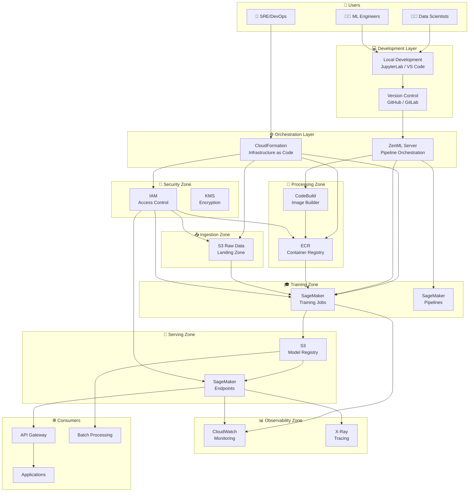

---

## 3. Component Architecture

### 3.1 Data Flow Architecture

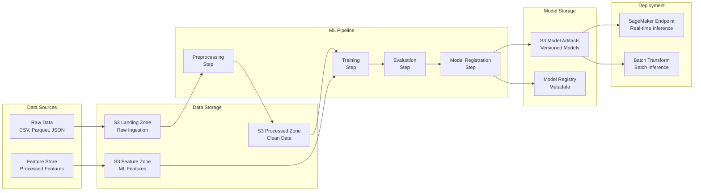

### 3.2 Training Pipeline Flow

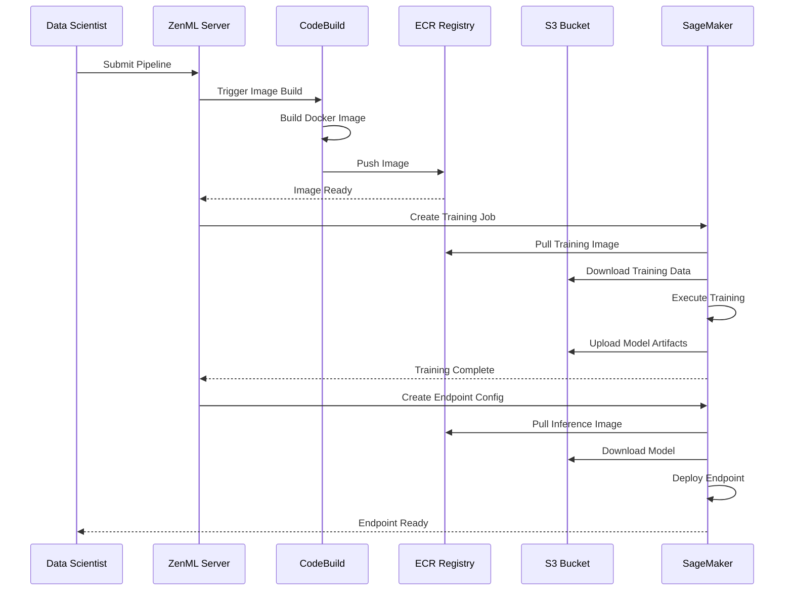

---

## 4. Service Architecture

### 4.1 Service Interactions

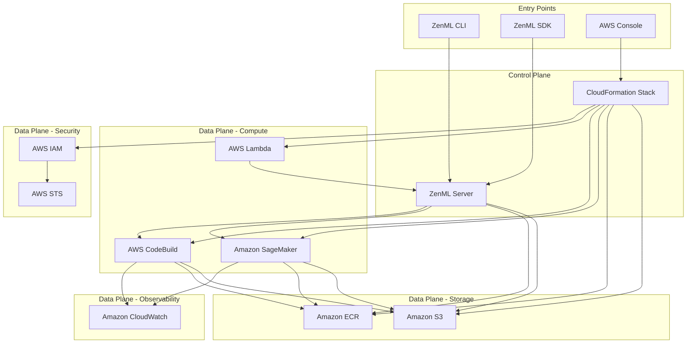

### 4.2 Security Architecture

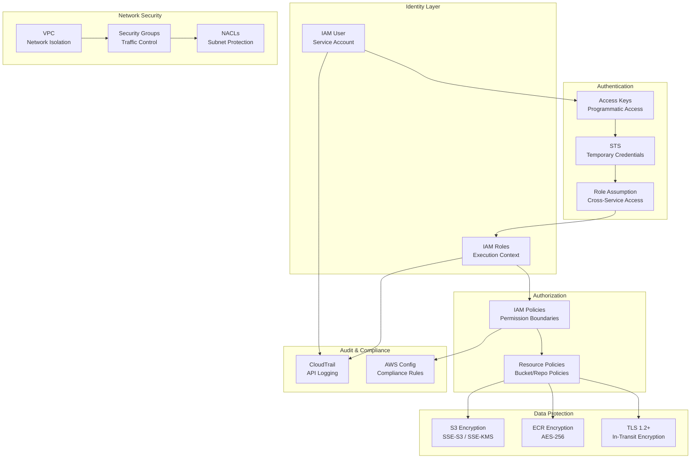

---

## 5. Deployment Architecture

### 5.1 Multi-Environment Strategy

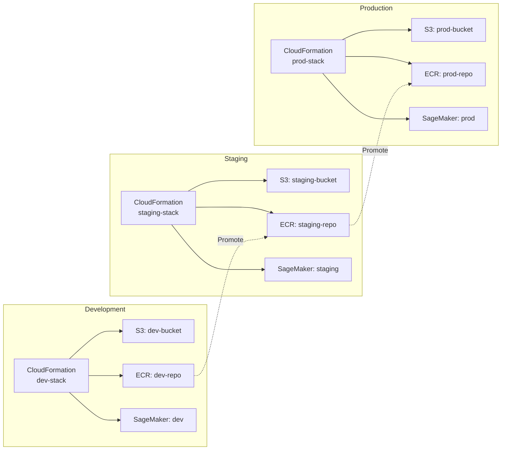

### 5.2 CI/CD Pipeline

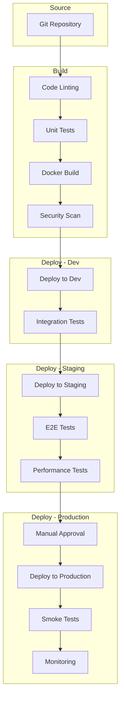

---

## 6. Scalability Architecture

### 6.1 Horizontal Scaling

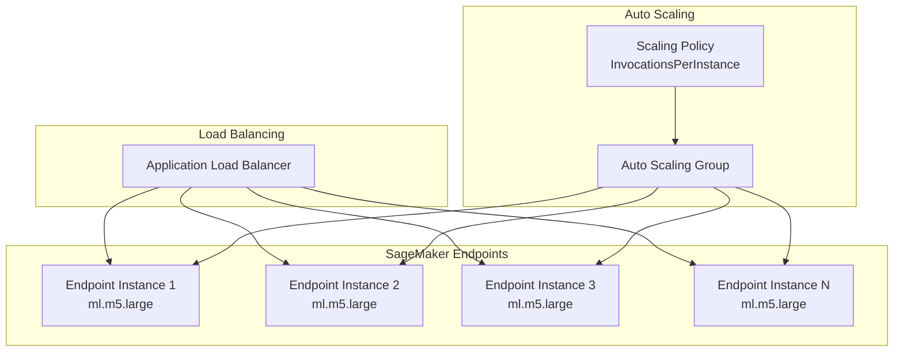

### 6.2 Capacity Planning

| Component | Baseline | Peak | Scaling Trigger |
|-----------|----------|------|-----------------|
| SageMaker Endpoints | 2 instances | 10 instances | CPU > 70% |
| Training Jobs | 5 concurrent | 20 concurrent | Queue depth > 10 |
| CodeBuild | 5 concurrent | 20 concurrent | Build queue > 5 |
| S3 Requests | 5,000/s | 55,000/s | Automatic |

---

## 7. High Availability Architecture

### 7.1 Multi-AZ Deployment

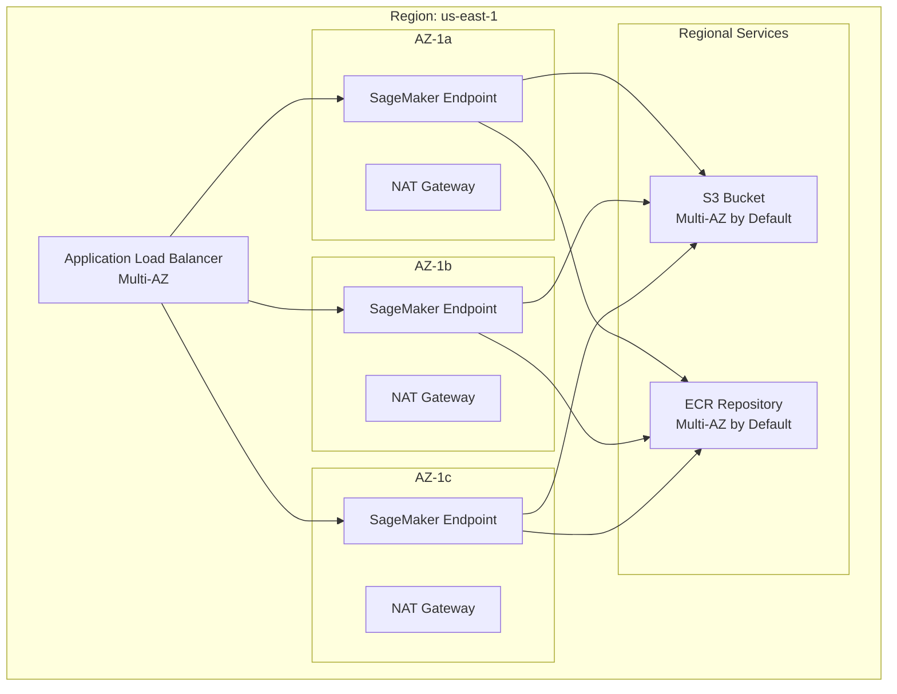

### 7.2 Disaster Recovery

| Tier | RTO | RPO | Strategy |
|------|-----|-----|----------|
| Tier 1 (Critical) | 1 hour | 15 min | Active-Active Multi-Region |
| Tier 2 (Important) | 4 hours | 1 hour | Warm Standby |
| Tier 3 (Standard) | 24 hours | 24 hours | Backup & Restore |

---

## 8. Integration Architecture

### 8.1 External Integrations

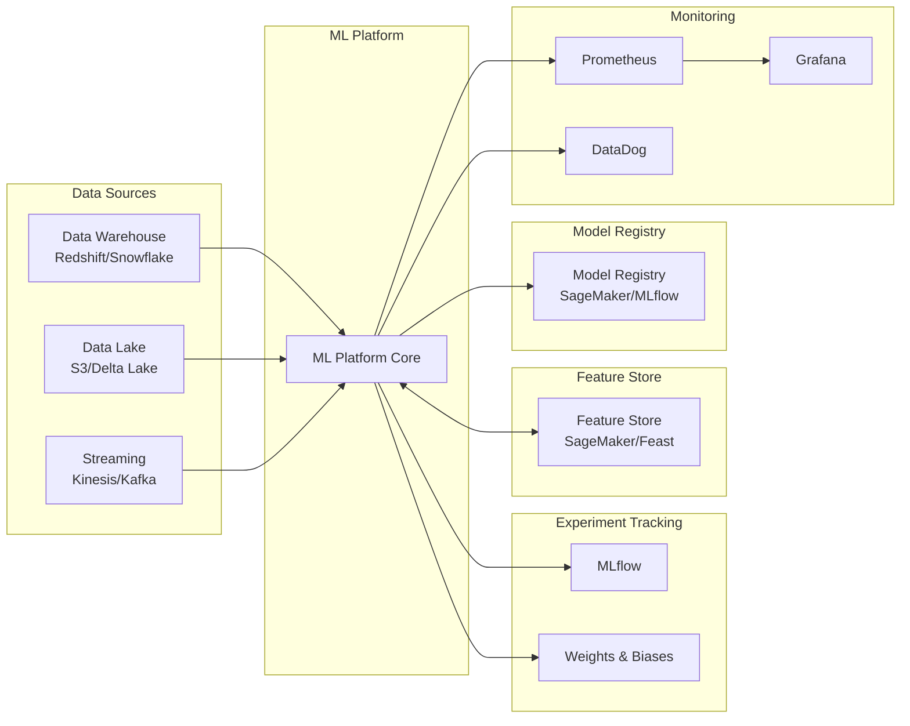

---

## 9. Cost Architecture

### 9.1 Cost Allocation

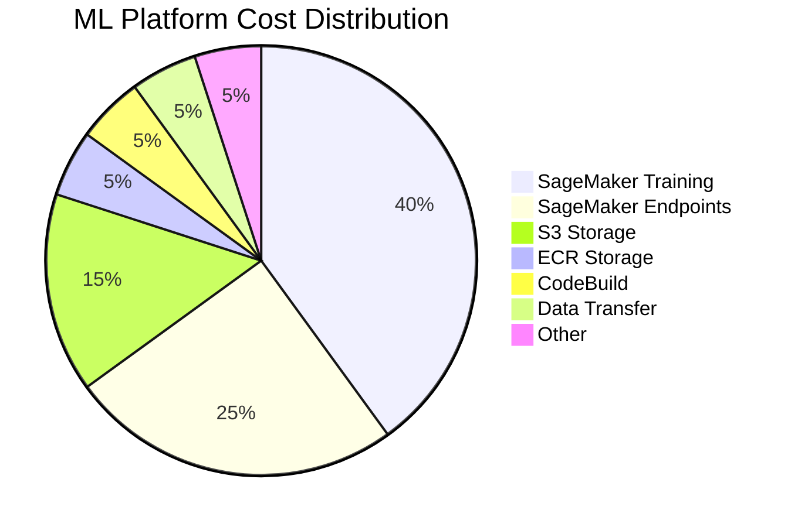

### 9.2 Cost Optimization Strategies

| Strategy | Implementation | Savings |
|----------|---------------|---------|
| Spot Instances | Training jobs | 60-90% |
| Reserved Capacity | Endpoints | 30-60% |
| S3 Intelligent Tiering | Storage | 20-40% |
| Right-sizing | Instance selection | 20-30% |
| Auto-scaling | Dynamic capacity | 15-25% |

---

## 10. Appendix

### 10.1 Glossary

| Term | Definition |
|------|------------|
| **ECR** | Elastic Container Registry - AWS managed Docker registry |
| **SageMaker** | AWS managed ML service for training and inference |
| **CloudFormation** | AWS Infrastructure as Code service |
| **IAM** | Identity and Access Management |
| **ZenML** | MLOps orchestration framework |

### 10.2 References

- AWS Well-Architected Framework - ML Lens
- AWS SageMaker Best Practices
- ZenML Documentation
- MLOps Maturity Model

---

## 🔗 Related Documents

- **[Low-Level Design](./LLD.md)** - Detailed component specifications
- **[Deployment Workflow](../03-deployment-workflow/README.md)** - CI/CD details
- **[Architect Decisions](../05-architect-decisions/README.md)** - ADRs
