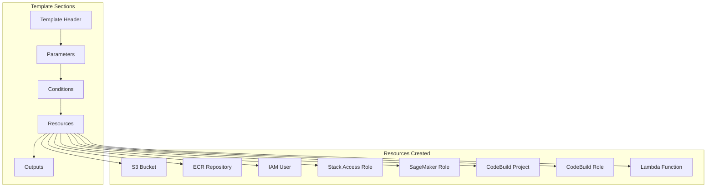
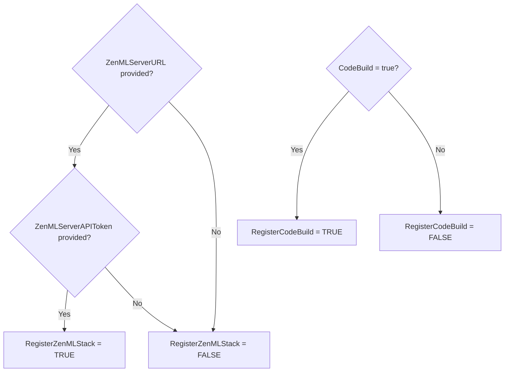
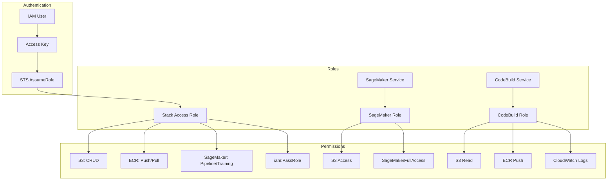
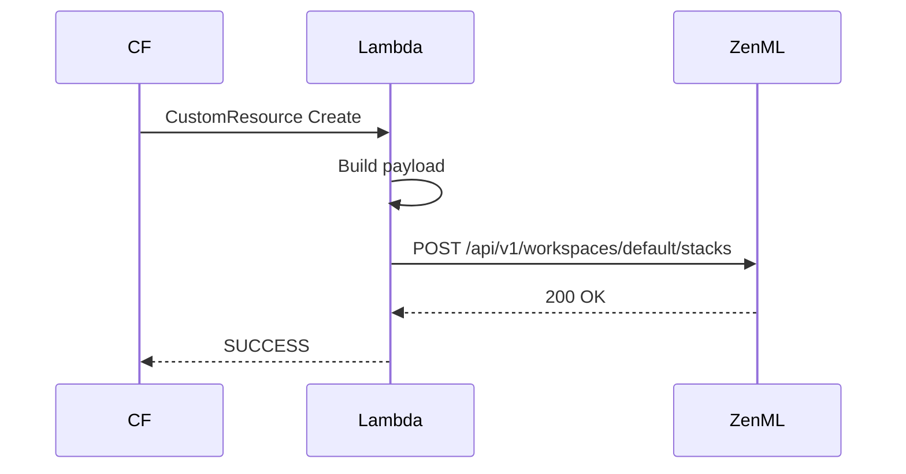
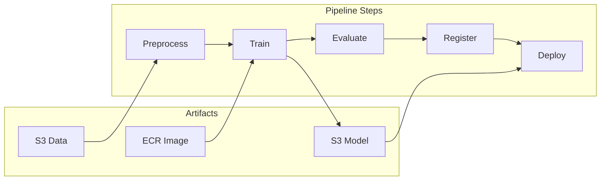

# 📋 Low-Level Design (LLD)

## Document Information
| Attribute | Value |
|-----------|-------|
| **Document Title** | ML Platform Low-Level Design |
| **Author** | ML Platform Engineer (Amazon) |
| **Last Updated** | December 2024 |

---

## 1. CloudFormation Template Structure



---

## 2. Parameter Specifications

| Parameter | Type | Constraints | Purpose |
|-----------|------|-------------|---------|
| `ResourceName` | String | 8-32 chars, `[a-z0-9-]+` | Base name for all resources |
| `ZenMLServerURL` | String | Valid URL pattern | ZenML server endpoint |
| `ZenMLServerAPIToken` | String | N/A | Authentication token |
| `TagName` | String | Default: `project` | Tag key |
| `TagValue` | String | Default: `zenml` | Tag value |
| `CodeBuild` | String | `true`/`false` | Enable image builder |

---

## 3. Condition Logic



---

## 4. S3 Bucket Design

**Naming**: `${ResourceName}-${AWS::AccountId}`

**Structure**:
```
s3://ml-platform-prod-123456789012/
├── artifacts/          # Pipeline outputs
├── data/
│   ├── training/      # Training datasets
│   └── validation/    # Validation data
├── models/            # Model artifacts
├── sagemaker/         # SageMaker output
└── codebuild/         # Build sources
```

---

## 5. ECR Repository Design

**Naming**: `${ResourceName}`

**Image URI Format**: `{account_id}.dkr.ecr.{region}.amazonaws.com/{repository}:{tag}`

**Tagging Strategy**:
| Pattern | Purpose |
|---------|---------|
| `latest` | Most recent |
| `v{semver}` | Versioned releases |
| `{git-sha}` | Commit reference |

---

## 6. IAM Architecture



---

## 7. CodeBuild Configuration

```yaml
Environment:
  Type: LINUX_CONTAINER
  ComputeType: BUILD_GENERAL1_SMALL
  Image: bentolor/docker-dind-awscli
  PrivilegedMode: false

Source:
  Type: S3
  Location: ${S3Bucket}/codebuild

TimeoutInMinutes: 20

LogsConfig:
  CloudWatchLogs:
    Status: ENABLED
```

---

## 8. Lambda Function Design

**Purpose**: Register stack with ZenML server via Custom Resource



**Stack Registration Payload**:
- Service Connector (AWS type, IAM role auth)
- Artifact Store (S3 flavor)
- Container Registry (AWS ECR flavor)
- Orchestrator (SageMaker flavor)
- Step Operator (SageMaker flavor)
- Image Builder (AWS or local flavor)

---

## 9. SageMaker Integration



---

## 10. Stack Outputs

| Output | Value | Purpose |
|--------|-------|---------|
| `AWSRegion` | Region | Deployment region |
| `AWSAccessKeyID` | Access Key | Programmatic access |
| `AWSSecretAccessKey` | Secret Key | Authentication |
| `IAMRoleARN` | Role ARN | Stack operations |
| `SageMakerIAMRoleARN` | SM Role ARN | Training execution |

---

## 🔗 Related Documents
- [HLD](./HLD.md) - High-level architecture
- [Deployment Workflow](../03-deployment-workflow/README.md)
