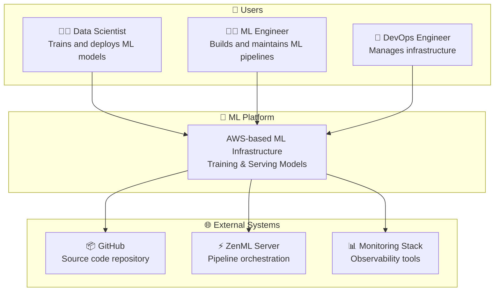
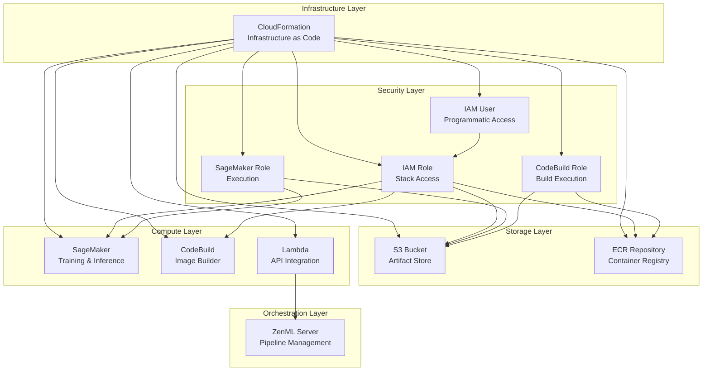
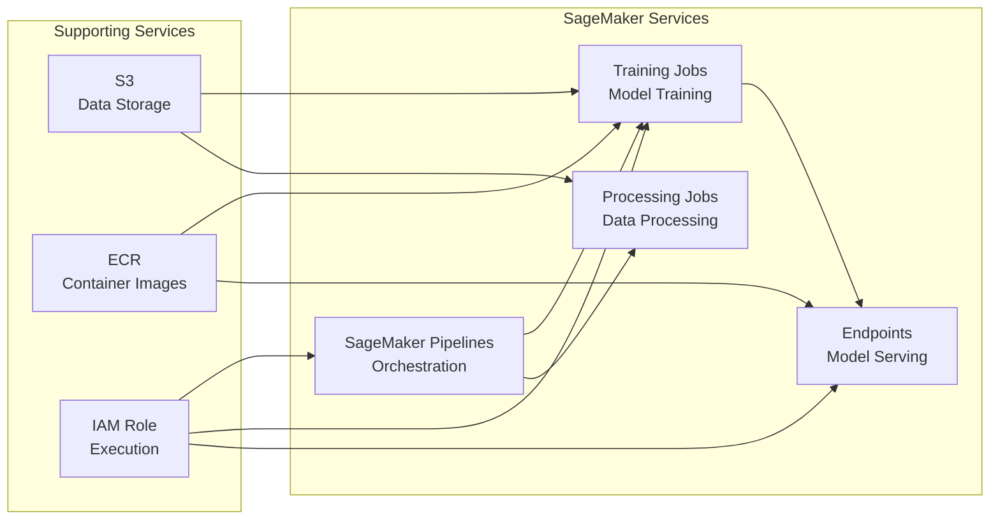
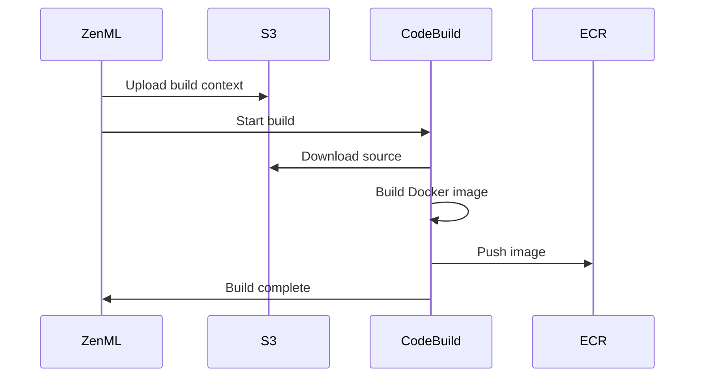
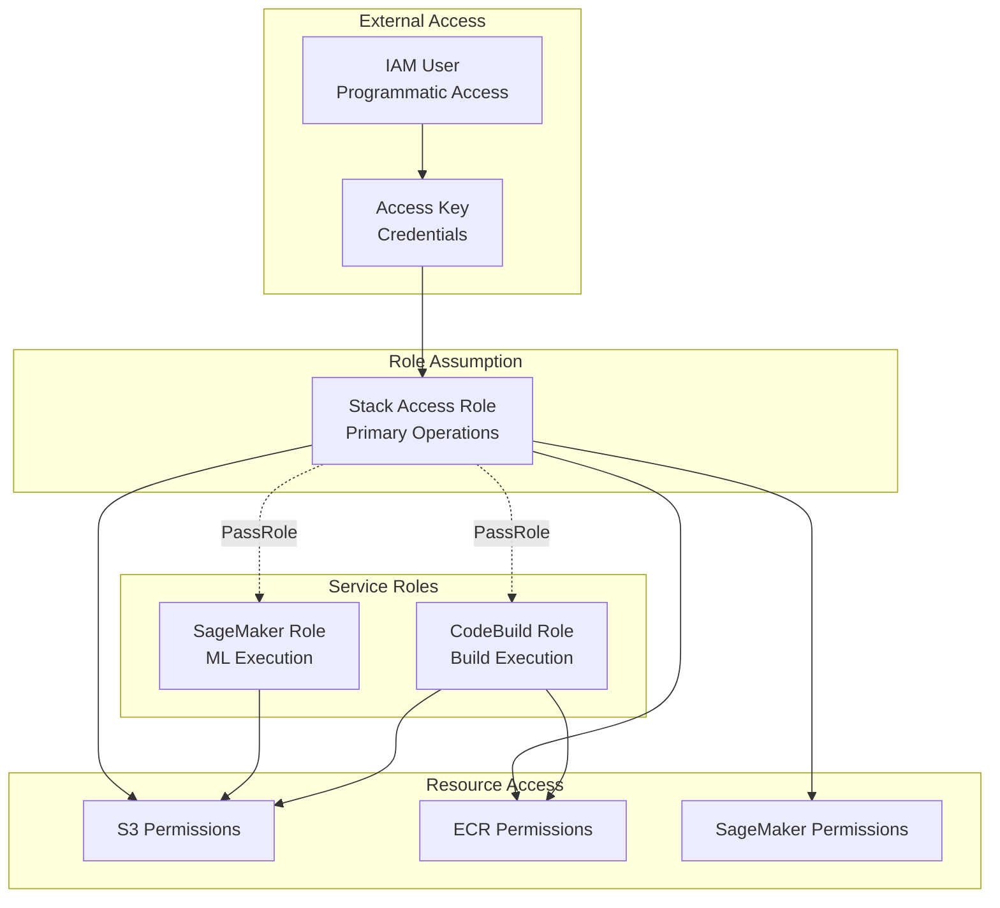
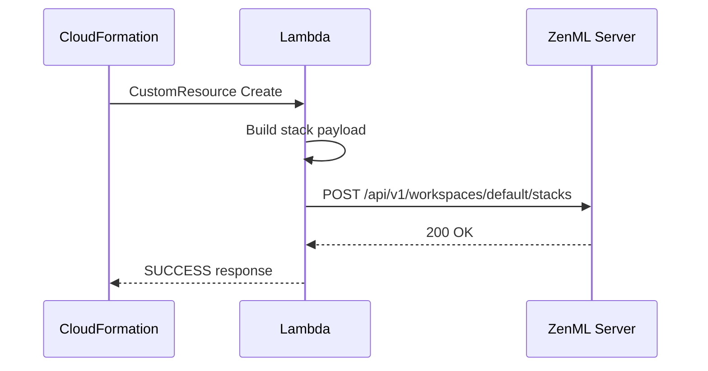
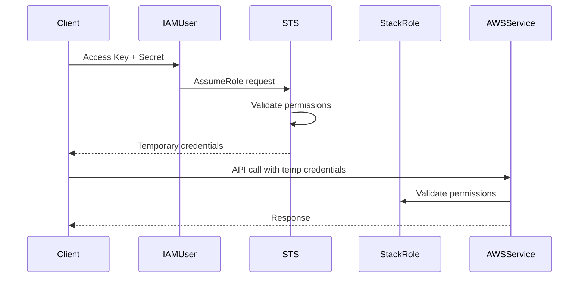
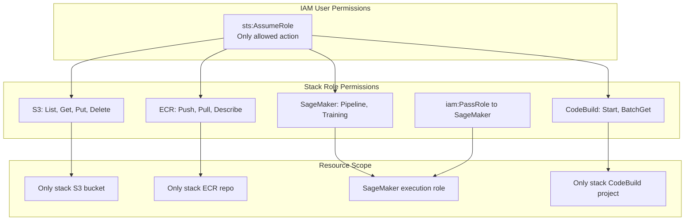

# 🏗️ Architecture Overview

## Introduction

This document provides a comprehensive overview of the ML Platform architecture that I designed and implemented at Amazon. The platform leverages AWS native services to provide a secure, scalable, and cost-effective solution for machine learning operations.

---

## 📊 System Context Diagram



---

## 🎯 Architecture Principles

### 1. **Infrastructure as Code (IaC)**
- All infrastructure defined in CloudFormation templates
- Version-controlled, auditable, and reproducible
- Enables GitOps workflows

### 2. **Least Privilege Access**
- Fine-grained IAM policies
- Role-based access control
- Service-specific execution roles

### 3. **Separation of Concerns**
- Distinct roles for different operations
- Isolated resources per environment
- Clear service boundaries

### 4. **Scalability by Design**
- Serverless where possible (Lambda, SageMaker)
- Auto-scaling capabilities
- Managed services for reduced operational overhead

### 5. **Security First**
- Encryption at rest and in transit
- Private resources (S3, ECR)
- IAM role assumption for cross-service access

---

## 🔧 Core Components

### Component Overview



---

## 📁 Resource Details

### 1. S3 Bucket (Artifact Store)

**Purpose**: Central storage for all ML artifacts

```yaml
Resource: AWS::S3::Bucket
Name: ${ResourceName}-${AWS::AccountId}
Access: Private
```

**Stored Data**:
- Training datasets
- Model artifacts (.pkl, .h5, .pt)
- Pipeline outputs
- SageMaker output data
- CodeBuild source archives

**Key Features**:
| Feature | Configuration | Benefit |
|---------|--------------|---------|
| Private Access | `AccessControl: Private` | Security compliance |
| Unique Naming | Account ID suffix | Cross-account uniqueness |
| Tagging | Project tags | Cost allocation |

---

### 2. ECR Repository (Container Registry)

**Purpose**: Store Docker images for ML pipelines

```yaml
Resource: AWS::ECR::Repository
Name: ${ResourceName}
```

**Image Types**:
- Training container images
- Inference container images
- Pipeline step images
- Custom algorithm containers

**Key Features**:
| Feature | Configuration | Benefit |
|---------|--------------|---------|
| Private Registry | Default | Security |
| Image Scanning | Available | Vulnerability detection |
| Lifecycle Policies | Configurable | Cost optimization |

---

### 3. SageMaker Integration

**Purpose**: Managed ML training and inference

**Components**:



**IAM Permissions**:
- `CreatePipeline`, `StartPipelineExecution`
- `DescribePipeline`, `DescribePipelineExecution`
- `CreateTrainingJob`, `DescribeTrainingJob`
- Full SageMaker access via managed policy

---

### 4. CodeBuild (Image Builder)

**Purpose**: Build Docker images for ML pipelines

```yaml
Resource: AWS::CodeBuild::Project
Condition: RegisterCodeBuild (optional)
Environment: LINUX_CONTAINER / BUILD_GENERAL1_SMALL
Image: bentolor/docker-dind-awscli
Timeout: 20 minutes
```

**Build Process**:



---

### 5. IAM Architecture

**Purpose**: Secure access control



**Role Details**:

| Role | Purpose | Trust Policy | Key Permissions |
|------|---------|--------------|-----------------|
| `${ResourceName}` | Stack operations | IAM User | S3, ECR, SageMaker, CodeBuild |
| `${ResourceName}-sagemaker` | SageMaker execution | sagemaker.amazonaws.com | S3, SageMakerFullAccess |
| `${ResourceName}-codebuild` | CodeBuild execution | codebuild.amazonaws.com | S3, ECR, CloudWatch Logs |

---

### 6. Lambda Function (ZenML Integration)

**Purpose**: Register stack with ZenML server

```yaml
Resource: AWS::Serverless::Function
Runtime: python3.8
Memory: 512MB
Timeout: 60s
```

**Workflow**:



**Payload Structure**:
```json
{
  "name": "${StackName}",
  "description": "Deployed by CloudFormation...",
  "labels": {
    "zenml:provider": "aws",
    "zenml:deployment": "cloud-formation"
  },
  "service_connectors": [...],
  "components": {
    "artifact_store": [...],
    "container_registry": [...],
    "orchestrator": [...],
    "step_operator": [...],
    "image_builder": [...]
  }
}
```

---

## 🔐 Security Architecture

### Authentication Flow



### Permission Boundaries



---

## 📈 Scalability Considerations

### Horizontal Scaling

| Component | Scaling Strategy | Limits |
|-----------|-----------------|--------|
| S3 | Automatic | Unlimited objects |
| ECR | Automatic | 10,000 repositories/region |
| SageMaker Training | Instance count | 20 instances default |
| SageMaker Endpoints | Auto-scaling policies | Based on metrics |
| CodeBuild | Concurrent builds | 60 default |

### Vertical Scaling

| Component | Options | Recommendation |
|-----------|---------|----------------|
| SageMaker Training | ml.m5.large to ml.p4d.24xlarge | Start small, scale as needed |
| SageMaker Endpoints | ml.t2.medium to ml.g5.48xlarge | Based on inference requirements |
| CodeBuild | SMALL, MEDIUM, LARGE | SMALL for most builds |

---

## 🔗 Related Documentation

- **[High-Level Design (HLD)](./HLD.md)** - System architecture and component interactions
- **[Low-Level Design (LLD)](./LLD.md)** - Detailed component specifications
- **[Deployment Workflow](../03-deployment-workflow/README.md)** - CI/CD pipeline details
