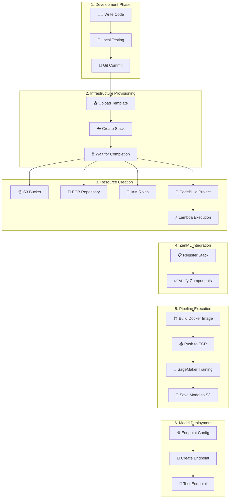
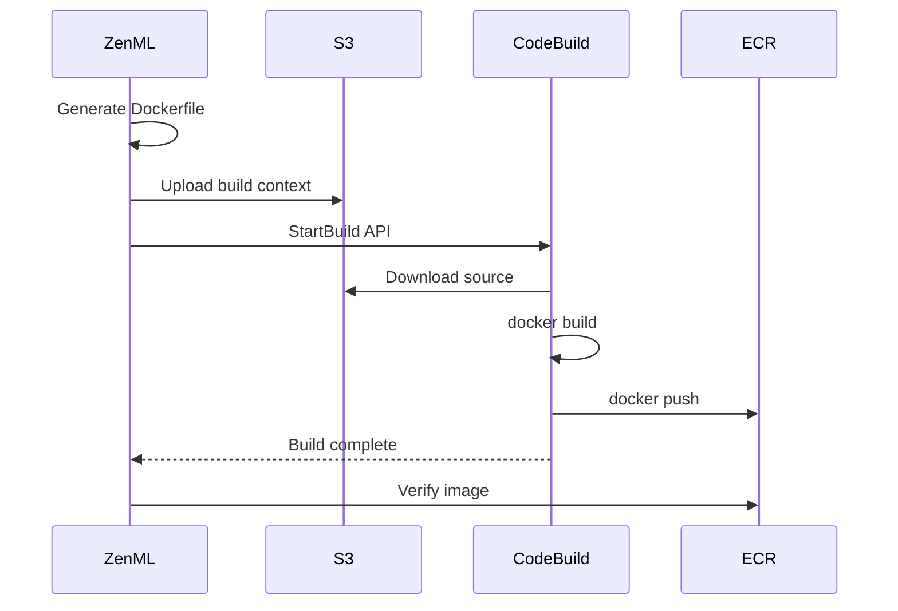
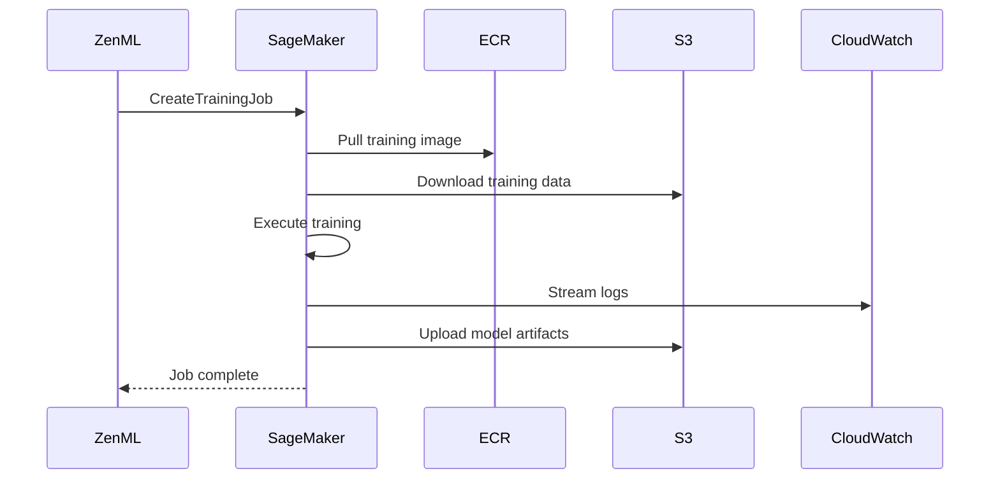
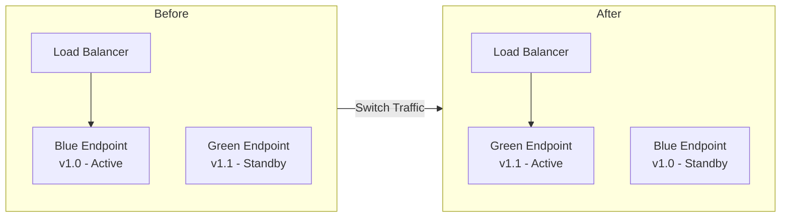
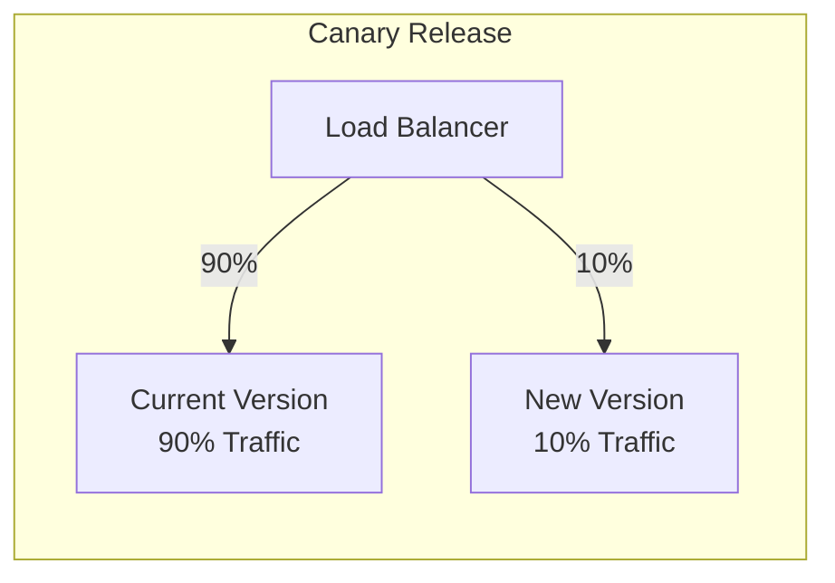

# 🚀 Deployment Workflow

## Overview

This document describes the complete deployment workflow for the ML Platform, from code commit to production deployment. As the ML Platform Engineer who built this system at Amazon, I designed this workflow to be reproducible, auditable, and production-ready.

---

## End-to-End Deployment Flow



---

## Phase 1: Infrastructure Provisioning

### Step 1.1: Prepare Parameters

```bash
# Define stack parameters
STACK_NAME="zenml-ml-platform"
RESOURCE_NAME="ml-platform-prod"
ZENML_URL="https://zenml.example.com"
ZENML_TOKEN="your-api-token"
REGION="eu-central-1"
```

### Step 1.2: Deploy CloudFormation Stack

```bash
# Create the stack
aws cloudformation create-stack \
  --stack-name $STACK_NAME \
  --template-body file://infra/aws/aws-ecr-s3-sagemaker.yaml \
  --parameters \
    ParameterKey=ResourceName,ParameterValue=$RESOURCE_NAME \
    ParameterKey=ZenMLServerURL,ParameterValue=$ZENML_URL \
    ParameterKey=ZenMLServerAPIToken,ParameterValue=$ZENML_TOKEN \
    ParameterKey=CodeBuild,ParameterValue=true \
  --capabilities CAPABILITY_NAMED_IAM \
  --region $REGION

# Wait for completion
aws cloudformation wait stack-create-complete \
  --stack-name $STACK_NAME \
  --region $REGION

# Verify stack status
aws cloudformation describe-stacks \
  --stack-name $STACK_NAME \
  --query 'Stacks[0].StackStatus' \
  --output text
```

### Step 1.3: Retrieve Stack Outputs

```bash
# Get all outputs
aws cloudformation describe-stacks \
  --stack-name $STACK_NAME \
  --query 'Stacks[0].Outputs'

# Export credentials
export AWS_ACCESS_KEY_ID=$(aws cloudformation describe-stacks \
  --stack-name $STACK_NAME \
  --query 'Stacks[0].Outputs[?OutputKey==`AWSAccessKeyID`].OutputValue' \
  --output text)

export AWS_SECRET_ACCESS_KEY=$(aws cloudformation describe-stacks \
  --stack-name $STACK_NAME \
  --query 'Stacks[0].Outputs[?OutputKey==`AWSSecretAccessKey`].OutputValue' \
  --output text)
```

---

## Phase 2: ZenML Stack Configuration

### Step 2.1: Connect to ZenML Server

```bash
# Connect ZenML client
zenml connect --url $ZENML_URL --api-key $ZENML_TOKEN

# List available stacks
zenml stack list

# Set active stack
zenml stack set $STACK_NAME

# Describe stack components
zenml stack describe
```

### Step 2.2: Verify Components

```python
from zenml.client import Client

client = Client()
stack = client.active_stack

# Verify each component
print(f"Artifact Store: {stack.artifact_store.config}")
print(f"Container Registry: {stack.container_registry.config}")
print(f"Orchestrator: {stack.orchestrator.config}")
print(f"Step Operator: {stack.step_operator.config}")
print(f"Image Builder: {stack.image_builder.config}")
```

---

## Phase 3: ML Pipeline Development

### Step 3.1: Create Pipeline Definition

```python
# pipelines/training_pipeline.py
from zenml import pipeline, step
from zenml.config import DockerSettings
import pandas as pd
from sklearn.ensemble import RandomForestClassifier
import joblib

docker_settings = DockerSettings(
    requirements=["pandas", "scikit-learn", "joblib"]
)

@step
def load_data() -> pd.DataFrame:
    """Load training data from S3."""
    # Data is automatically loaded from artifact store
    return pd.read_csv("s3://bucket/data/training.csv")

@step
def preprocess(data: pd.DataFrame) -> tuple:
    """Preprocess the data."""
    X = data.drop("target", axis=1)
    y = data["target"]
    return X, y

@step
def train_model(X: pd.DataFrame, y: pd.Series) -> RandomForestClassifier:
    """Train the model."""
    model = RandomForestClassifier(n_estimators=100)
    model.fit(X, y)
    return model

@step
def evaluate_model(model: RandomForestClassifier, X: pd.DataFrame, y: pd.Series) -> float:
    """Evaluate model performance."""
    accuracy = model.score(X, y)
    print(f"Model accuracy: {accuracy}")
    return accuracy

@pipeline(settings={"docker": docker_settings})
def training_pipeline():
    """Complete training pipeline."""
    data = load_data()
    X, y = preprocess(data)
    model = train_model(X, y)
    accuracy = evaluate_model(model, X, y)
    return model, accuracy
```

### Step 3.2: Run Pipeline

```bash
# Run the pipeline
python -c "from pipelines.training_pipeline import training_pipeline; training_pipeline()"

# Or with CLI
zenml pipeline run training_pipeline
```

---

## Phase 4: Image Build Process



### Generated Dockerfile Example

```dockerfile
FROM python:3.9-slim

WORKDIR /app

# Install dependencies
COPY requirements.txt .
RUN pip install --no-cache-dir -r requirements.txt

# Copy pipeline code
COPY . .

# Set entrypoint
ENTRYPOINT ["python", "-m", "zenml.entrypoints.step_entrypoint"]
```

---

## Phase 5: SageMaker Training



### Training Job Configuration

```python
training_config = {
    "instance_type": "ml.m5.large",
    "instance_count": 1,
    "volume_size": 50,
    "max_runtime": 3600,
    "output_path": "s3://bucket/sagemaker/"
}
```

---

## Phase 6: Model Deployment

### Step 6.1: Create Model

```python
import boto3

sagemaker = boto3.client('sagemaker')

# Create model
response = sagemaker.create_model(
    ModelName='ml-platform-model-v1',
    PrimaryContainer={
        'Image': f'{account_id}.dkr.ecr.{region}.amazonaws.com/{repo}:latest',
        'ModelDataUrl': 's3://bucket/models/model.tar.gz'
    },
    ExecutionRoleArn=sagemaker_role_arn
)
```

### Step 6.2: Create Endpoint Configuration

```python
# Create endpoint config
sagemaker.create_endpoint_config(
    EndpointConfigName='ml-platform-config-v1',
    ProductionVariants=[{
        'VariantName': 'primary',
        'ModelName': 'ml-platform-model-v1',
        'InstanceType': 'ml.m5.large',
        'InitialInstanceCount': 2,
        'InitialVariantWeight': 1.0
    }]
)
```

### Step 6.3: Deploy Endpoint

```python
# Create endpoint
sagemaker.create_endpoint(
    EndpointName='ml-platform-endpoint',
    EndpointConfigName='ml-platform-config-v1'
)

# Wait for deployment
waiter = sagemaker.get_waiter('endpoint_in_service')
waiter.wait(EndpointName='ml-platform-endpoint')
```

---

## Phase 7: Validation & Testing

### Endpoint Testing

```python
import boto3
import json

runtime = boto3.client('sagemaker-runtime')

# Test inference
response = runtime.invoke_endpoint(
    EndpointName='ml-platform-endpoint',
    ContentType='application/json',
    Body=json.dumps({"features": [1.0, 2.0, 3.0, 4.0]})
)

prediction = json.loads(response['Body'].read())
print(f"Prediction: {prediction}")
```

---

## Deployment Strategies

### Blue-Green Deployment



### Canary Deployment



---

## Rollback Procedures

```bash
# Rollback to previous endpoint configuration
aws sagemaker update-endpoint \
    --endpoint-name ml-platform-endpoint \
    --endpoint-config-name ml-platform-config-previous

# Monitor rollback
aws sagemaker describe-endpoint \
    --endpoint-name ml-platform-endpoint
```

---

## 🔗 Related Documents

- [Architecture Overview](../02-architecture/README.md)
- [Troubleshooting Guide](../06-troubleshooting/README.md)
- [Best Practices](../07-best-practices/README.md)
