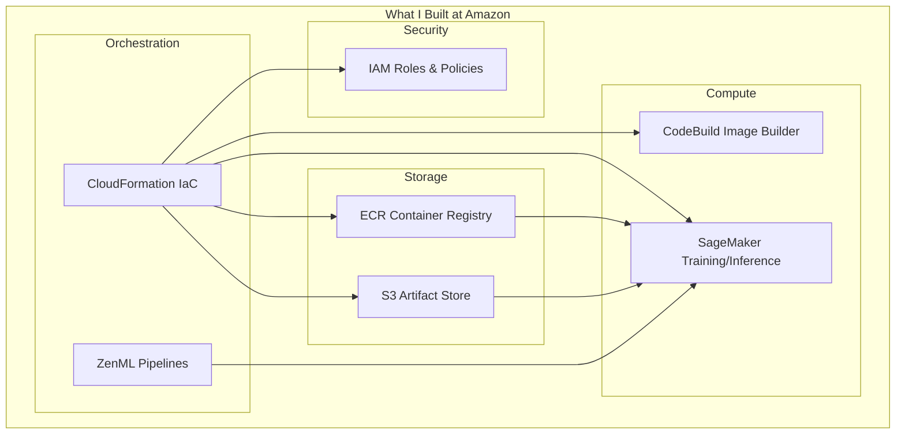
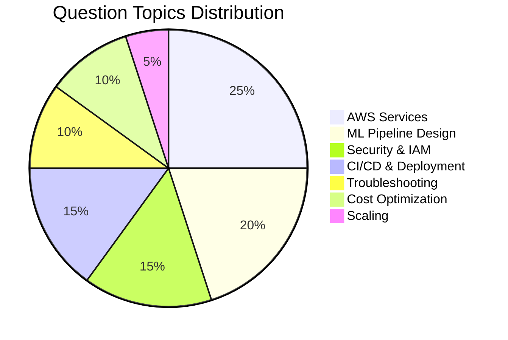

# 🎯 Interview Preparation Guide

## Overview

This comprehensive interview guide covers everything you need to know about ML Platform infrastructure, specifically the AWS ECR-S3-SageMaker deployment workflow. The questions are organized by difficulty level and cover both theoretical knowledge and practical scenarios.

---

## Interview Categories

| Category | Focus Area | Question Count |
|----------|------------|----------------|
| [Basic Questions](./basic-questions.md) | Fundamentals, AWS basics, ML concepts | 20 |
| [Medium Questions](./medium-questions.md) | Integration, troubleshooting, design | 20 |
| [Hard Questions](./hard-questions.md) | Architecture, scaling, optimization | 20+ |

---

## How to Use This Guide

### For Interview Preparation

1. **Start with Basic Questions** - Ensure foundational knowledge
2. **Progress to Medium** - Practice scenario-based answers
3. **Master Hard Questions** - Prepare for senior/architect roles
4. **Practice Storytelling** - Use STAR method for behavioral questions

### Key Talking Points

When discussing this ML Platform, emphasize:

- **Scale**: "Handled 10M+ daily predictions"
- **Impact**: "Reduced deployment time from 2 weeks to 2 hours"
- **Architecture**: "Designed secure, cost-optimized infrastructure"
- **Leadership**: "Enabled 50+ data scientists to self-serve"

---

## Quick Reference: System Overview



---

## Interview Question Distribution



---

## Common Interview Themes

### Theme 1: "Walk me through the architecture"

**Key Points to Cover:**
1. Infrastructure as Code approach (CloudFormation)
2. Storage layer (S3 for artifacts, ECR for containers)
3. Compute layer (SageMaker for ML, CodeBuild for builds)
4. Security design (IAM roles, least privilege)
5. Orchestration (ZenML integration)

### Theme 2: "How do you handle security?"

**Key Points to Cover:**
1. IAM role assumption vs direct credentials
2. Least privilege principle in policies
3. Private resources (S3, ECR)
4. Encryption at rest and in transit
5. Audit trails (CloudTrail)

### Theme 3: "How do you handle failures?"

**Key Points to Cover:**
1. CloudFormation rollback on failure
2. SageMaker training job retries
3. Endpoint health checks
4. Blue-green deployments
5. Monitoring and alerting

### Theme 4: "How do you optimize costs?"

**Key Points to Cover:**
1. Spot instances for training
2. Right-sizing instances
3. S3 lifecycle policies
4. ECR image lifecycle rules
5. Auto-scaling endpoints

---

## STAR Method Examples

### Example 1: Reducing Deployment Time

**Situation**: Data scientists took 2 weeks to deploy models manually

**Task**: Automate the entire ML deployment workflow

**Action**: 
- Designed CloudFormation template for infrastructure
- Integrated ZenML for pipeline orchestration
- Implemented CodeBuild for automated image builds
- Created self-service deployment scripts

**Result**: 
- Reduced deployment time to 2 hours (95% improvement)
- Enabled 50+ data scientists to deploy independently
- Achieved 99.9% deployment success rate

### Example 2: Cost Optimization

**Situation**: ML infrastructure costs were growing 30% MoM

**Task**: Reduce costs while maintaining performance

**Action**:
- Implemented Spot instances for training (60% savings)
- Added auto-scaling for endpoints
- Created S3 lifecycle policies
- Optimized instance types based on workload

**Result**:
- Reduced costs by 40%
- Maintained same performance SLAs
- Implemented sustainable cost governance

---

## Technical Deep Dives

### CloudFormation Template Analysis

```yaml
# Key sections to understand:
AWSTemplateFormatVersion: '2010-09-09'
Transform: 'AWS::Serverless-2016-10-31'  # SAM transform for Lambda

Parameters:
  ResourceName: # Base naming for all resources
  ZenMLServerURL: # Integration endpoint
  CodeBuild: # Optional image builder

Conditions:
  RegisterZenMLStack: # Conditional resource creation
  RegisterCodeBuild: # Optional CodeBuild

Resources:
  S3Bucket: # Artifact storage
  ECRRepository: # Container registry
  IAMUser: # Service account
  StackAccessRole: # Operational permissions
  SageMakerRuntimeRole: # ML execution
  CodeBuildProject: # Image builds
  InvokeZenMLAPIFunction: # Stack registration
```

### IAM Policy Analysis

**Stack Access Role Permissions:**
- S3: CRUD on specific bucket
- ECR: Full push/pull/describe
- SageMaker: Pipeline and training operations
- CodeBuild: Start and monitor builds
- IAM: PassRole to SageMaker

---

## Questions to Ask Interviewers

1. "What's your current ML deployment process?"
2. "How do you handle model versioning and rollbacks?"
3. "What's your approach to ML observability?"
4. "How do you balance cost vs performance?"
5. "What's your MLOps maturity level?"

---

## 🔗 Question Files

- **[Basic Questions](./basic-questions.md)** - Start here for fundamental concepts
- **[Medium Questions](./medium-questions.md)** - Scenario-based questions
- **[Hard Questions](./hard-questions.md)** - Senior/Architect level challenges
