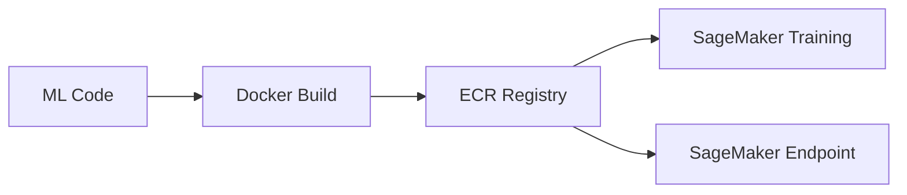
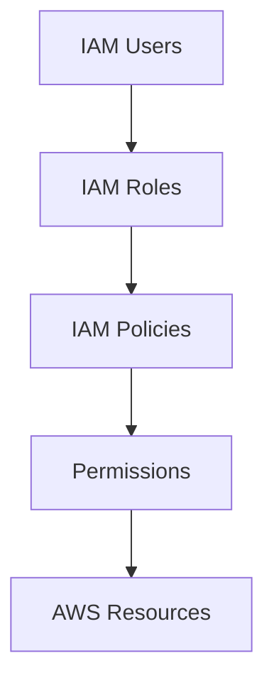
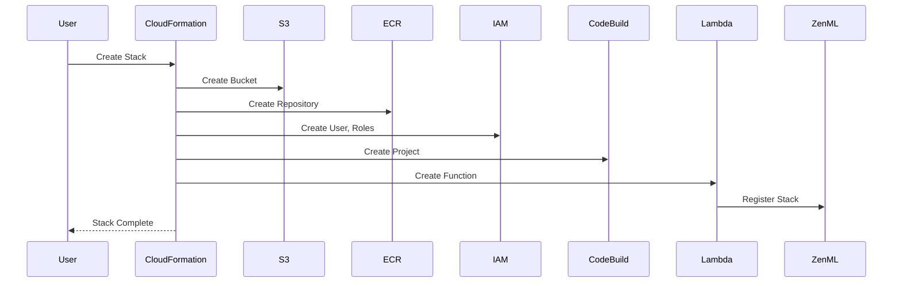

# 📗 Basic Interview Questions

## Category 1: AWS Fundamentals

### Q1: What is Amazon S3 and why did you use it for the ML Platform?

**Answer:**
Amazon S3 (Simple Storage Service) is an object storage service offering scalability, data availability, and security.

**Why I chose S3 for this platform:**
- **Durability**: 99.999999999% (11 nines) durability
- **Scalability**: Unlimited storage capacity
- **Integration**: Native integration with SageMaker
- **Versioning**: Built-in object versioning for model artifacts
- **Cost-effective**: Pay only for what you use

**In our platform, S3 stores:**
- Training datasets
- Model artifacts (`.pkl`, `.h5`, `.pt` files)
- Pipeline outputs and metadata
- SageMaker output data
- CodeBuild source archives

---

### Q2: What is Amazon ECR and how does it fit into ML pipelines?

**Answer:**
Amazon ECR (Elastic Container Registry) is a fully managed Docker container registry.

**Role in ML Platform:**


**Key benefits:**
- Private, secure container storage
- Integrated with IAM for access control
- Automatic image scanning for vulnerabilities
- High availability across AZs
- No separate infrastructure to manage

---

### Q3: What is AWS SageMaker?

**Answer:**
SageMaker is AWS's fully managed ML service for building, training, and deploying models.

**Components we use:**
| Component | Purpose |
|-----------|---------|
| Training Jobs | Execute model training |
| Pipelines | Orchestrate ML workflows |
| Endpoints | Serve model predictions |
| Processing Jobs | Data preprocessing |

**Why SageMaker:**
- Managed infrastructure (no servers to maintain)
- Built-in algorithms and frameworks
- Automatic scaling
- Pay-per-use pricing
- Integration with AWS ecosystem

---

### Q4: Explain AWS CloudFormation in simple terms.

**Answer:**
CloudFormation is AWS's Infrastructure as Code (IaC) service.

**Key Concepts:**
- **Template**: YAML/JSON file describing resources
- **Stack**: Collection of resources created from template
- **Parameters**: Input values for customization
- **Outputs**: Values exposed after creation

**Benefits:**
- Reproducible infrastructure
- Version controlled
- Automatic rollback on failure
- Dependency management
- Multi-region deployment

---

### Q5: What is IAM and why is it important?

**Answer:**
IAM (Identity and Access Management) controls who can access AWS resources.

**Core Components:**


**In our platform:**
- IAM User for programmatic access
- Stack Access Role for operations
- SageMaker Role for ML execution
- CodeBuild Role for image builds

---

## Category 2: ML Concepts

### Q6: What is an ML Pipeline?

**Answer:**
An ML pipeline is an automated workflow that orchestrates the steps of a machine learning process.

**Typical Pipeline Stages:**
1. **Data Ingestion**: Load data from sources
2. **Preprocessing**: Clean and transform data
3. **Feature Engineering**: Create ML features
4. **Training**: Train the model
5. **Evaluation**: Test model performance
6. **Registration**: Save model to registry
7. **Deployment**: Deploy to endpoint

---

### Q7: What is model versioning?

**Answer:**
Model versioning tracks different iterations of ML models.

**Our approach:**
- S3 versioning for model artifacts
- ECR image tags for container versions
- ZenML artifact tracking
- SageMaker Model Registry integration

**Format**: `model-name:v{major}.{minor}.{patch}`

---

### Q8: What is the difference between training and inference?

**Answer:**
| Aspect | Training | Inference |
|--------|----------|-----------|
| Purpose | Learn patterns from data | Make predictions |
| Compute | High (GPUs often needed) | Lower (can be CPU) |
| Duration | Hours to days | Milliseconds |
| Data | Large training datasets | Single data points |
| Frequency | Periodic | Continuous |

---

## Category 3: Platform Basics

### Q9: Walk me through what happens when you deploy this CloudFormation template.

**Answer:**


**Order of creation:**
1. Parameters validated
2. S3 bucket created
3. ECR repository created
4. IAM user and access keys created
5. IAM roles created (depends on user)
6. CodeBuild project (if enabled)
7. Lambda function (if ZenML configured)
8. Custom resource triggers Lambda
9. Stack outputs generated

---

### Q10: What are the main components created by the template?

**Answer:**
| Resource | Type | Purpose |
|----------|------|---------|
| S3 Bucket | Storage | Artifact store |
| ECR Repository | Container | Image registry |
| IAM User | Identity | Programmatic access |
| IAM Access Key | Credential | Authentication |
| Stack Access Role | Authorization | Operations |
| SageMaker Role | Authorization | ML execution |
| CodeBuild Project | CI/CD | Image building |
| CodeBuild Role | Authorization | Build operations |
| Lambda Function | Compute | ZenML registration |

---

### Q11: What is ZenML and why use it?

**Answer:**
ZenML is an open-source MLOps framework for creating portable, production-ready ML pipelines.

**Why we integrated it:**
- **Abstraction**: Write once, run anywhere
- **Reproducibility**: Track all artifacts
- **Flexibility**: Swap infrastructure components
- **Standards**: Enforces ML best practices

---

### Q12: What parameters does the template accept?

**Answer:**
| Parameter | Required | Description |
|-----------|----------|-------------|
| `ResourceName` | Yes | Base name for all resources |
| `ZenMLServerURL` | No | ZenML server endpoint |
| `ZenMLServerAPIToken` | No | API authentication |
| `TagName` | No | Tag key (default: project) |
| `TagValue` | No | Tag value (default: zenml) |
| `CodeBuild` | No | Enable image builder |

---

## Category 4: Docker & Containers

### Q13: Why use containers for ML?

**Answer:**
**Benefits:**
- **Reproducibility**: Same environment everywhere
- **Isolation**: Dependencies don't conflict
- **Portability**: Run on any container runtime
- **Versioning**: Tag and track container versions
- **Scaling**: Easy horizontal scaling

---

### Q14: What is CodeBuild and how does it work?

**Answer:**
CodeBuild is AWS's managed build service.

**Our configuration:**
- **Image**: Docker-in-Docker with AWS CLI
- **Source**: S3 bucket
- **Output**: Docker images to ECR
- **Timeout**: 20 minutes

---

### Q15: How does image authentication work with ECR?

**Answer:**
```bash
# Get authentication token
aws ecr get-login-password --region eu-central-1 | \
  docker login --username AWS --password-stdin \
  123456789012.dkr.ecr.eu-central-1.amazonaws.com

# Token valid for 12 hours
```

---

## Category 5: Basic Troubleshooting

### Q16: Stack creation failed. What do you check first?

**Answer:**
1. **CloudFormation Events**: Check failure reason
2. **IAM Permissions**: Verify CAPABILITY_NAMED_IAM
3. **Resource Names**: Check for conflicts
4. **Parameter Values**: Validate inputs
5. **Service Limits**: Check quotas

---

### Q17: How do you verify the stack deployed correctly?

**Answer:**
```bash
# Check stack status
aws cloudformation describe-stacks --stack-name zenml-ml-platform

# Verify resources
aws s3 ls | grep ml-platform
aws ecr describe-repositories
aws iam get-role --role-name ml-platform-prod
```

---

### Q18: What's the difference between IAM users and roles?

**Answer:**
| Aspect | IAM User | IAM Role |
|--------|----------|----------|
| Identity | Long-term | Temporary |
| Credentials | Access keys | Session tokens |
| Use case | Service accounts | Cross-service access |
| Best practice | Avoid when possible | Prefer roles |

---

### Q19: What happens if ZenML registration fails?

**Answer:**
- CloudFormation stack still creates AWS resources
- Lambda logs error to CloudWatch
- Custom resource returns FAILED status
- Stack may rollback (depending on failure mode)

**Recovery:**
- Check Lambda logs
- Verify ZenML server connectivity
- Validate API token
- Retry with updated parameters

---

### Q20: How do you check SageMaker training job status?

**Answer:**
```bash
# List training jobs
aws sagemaker list-training-jobs

# Describe specific job
aws sagemaker describe-training-job \
  --training-job-name my-training-job

# Watch logs
aws logs get-log-events \
  --log-group-name /aws/sagemaker/TrainingJobs \
  --log-stream-name my-training-job/algo-1
```

---

## 🔗 Next Level
Continue to **[Medium Questions](./medium-questions.md)** for scenario-based challenges.
