# 📕 Hard Interview Questions

## Category 1: Complex Architecture Decisions

### Q1: Design a multi-region ML platform for disaster recovery. How would you modify this architecture?

**Answer:**

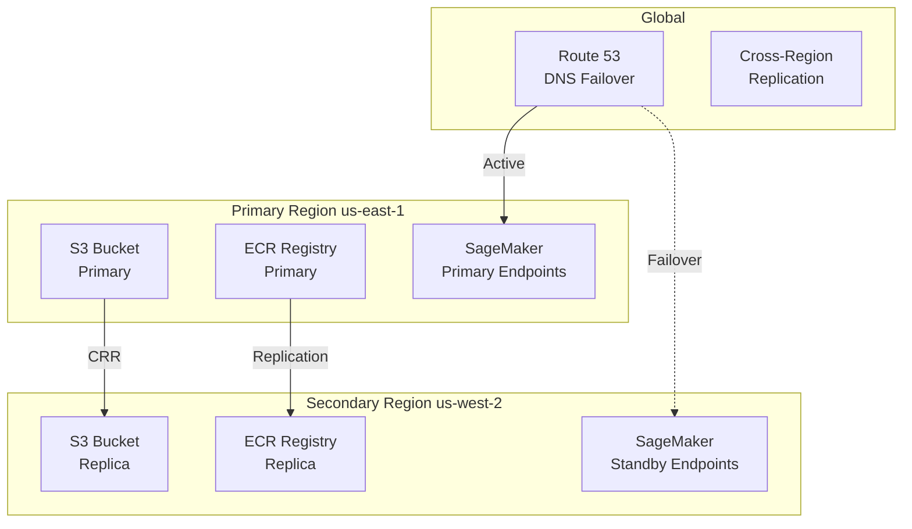

**Implementation Steps:**

1. **S3 Cross-Region Replication:**
```yaml
ReplicationConfiguration:
  Role: !GetAtt ReplicationRole.Arn
  Rules:
    - Status: Enabled
      Destination:
        Bucket: arn:aws:s3:::bucket-us-west-2
        StorageClass: STANDARD
```

2. **ECR Cross-Region Replication:**
```yaml
ReplicationConfiguration:
  Rules:
    - Destinations:
        - Region: us-west-2
          RegistryId: "123456789012"
```

3. **Route 53 Health Checks:**
```yaml
HealthCheck:
  Type: AWS::Route53::HealthCheck
  Properties:
    HealthCheckConfig:
      Type: HTTPS
      FullyQualifiedDomainName: primary-endpoint.example.com
      ResourcePath: /ping
```

**Trade-offs:**
| Factor | Single Region | Multi-Region |
|--------|---------------|--------------|
| Cost | Lower | 2x+ higher |
| Latency | Single region | Global optimization |
| Complexity | Simple | Complex |
| RTO | Hours | Minutes |
| RPO | Depends on backup | Near-zero |

---

### Q2: How would you implement blue-green deployments for ML models with zero downtime?

**Answer:**

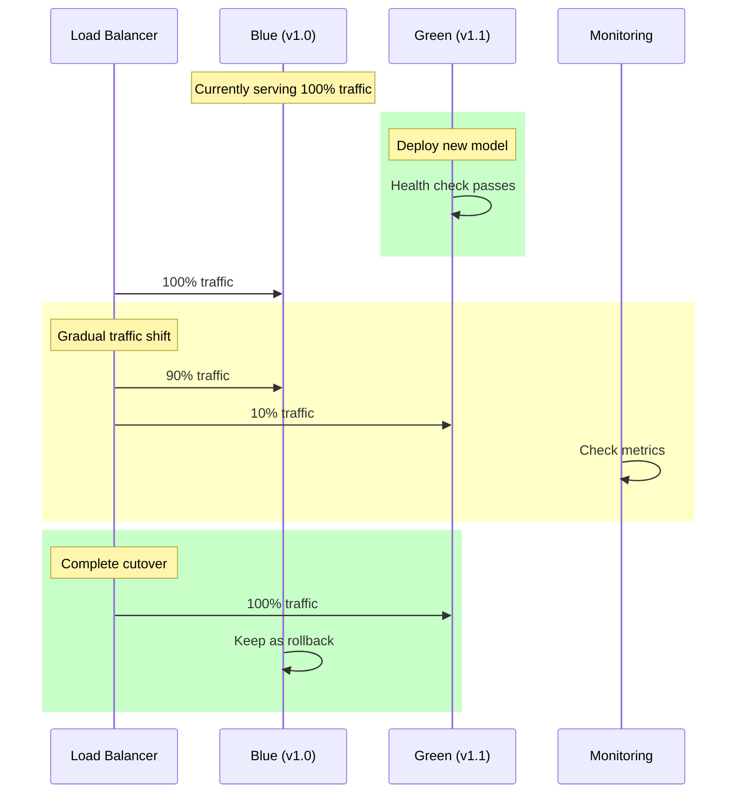

**Implementation with SageMaker:**

```python
# Create new endpoint config (Green)
sagemaker.create_endpoint_config(
    EndpointConfigName='model-v1.1-config',
    ProductionVariants=[{
        'VariantName': 'green',
        'ModelName': 'model-v1.1',
        'InitialInstanceCount': 2,
        'InstanceType': 'ml.m5.large'
    }]
)

# Update endpoint with traffic shifting
sagemaker.update_endpoint(
    EndpointName='production-endpoint',
    EndpointConfigName='model-v1.1-config',
    DeploymentConfig={
        'BlueGreenUpdatePolicy': {
            'TrafficRoutingConfiguration': {
                'Type': 'LINEAR',
                'LinearStepSize': {
                    'Type': 'CAPACITY_PERCENT',
                    'Value': 10
                },
                'WaitIntervalInSeconds': 300
            },
            'MaximumExecutionTimeoutInSeconds': 3600
        },
        'AutoRollbackConfiguration': {
            'Alarms': [{'AlarmName': 'ModelLatencyAlarm'}]
        }
    }
)
```

**Rollback triggers:**
- P99 latency > threshold
- Error rate > threshold
- Business metric degradation

---

### Q3: Explain how you would handle model A/B testing at scale (1M+ requests/day).

**Answer:**

**Architecture:**
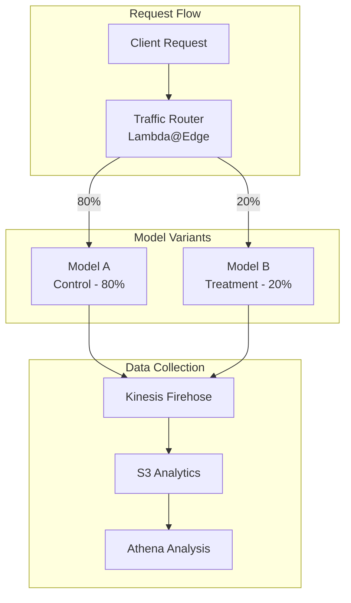

**Traffic splitting with SageMaker:**
```python
sagemaker.create_endpoint_config(
    EndpointConfigName='ab-test-config',
    ProductionVariants=[
        {
            'VariantName': 'control',
            'ModelName': 'model-v1.0',
            'InitialVariantWeight': 0.8
        },
        {
            'VariantName': 'treatment',
            'ModelName': 'model-v1.1',
            'InitialVariantWeight': 0.2
        }
    ]
)
```

**Statistical significance calculation:**
```python
from scipy import stats

def calculate_significance(control_conversions, control_total,
                          treatment_conversions, treatment_total):
    control_rate = control_conversions / control_total
    treatment_rate = treatment_conversions / treatment_total
    
    # Chi-square test
    contingency = [[control_conversions, control_total - control_conversions],
                   [treatment_conversions, treatment_total - treatment_conversions]]
    chi2, p_value, _, _ = stats.chi2_contingency(contingency)
    
    return {
        'control_rate': control_rate,
        'treatment_rate': treatment_rate,
        'lift': (treatment_rate - control_rate) / control_rate,
        'p_value': p_value,
        'significant': p_value < 0.05
    }
```

---

### Q4: Design a feature store integration for this platform. What components would you add?

**Answer:**

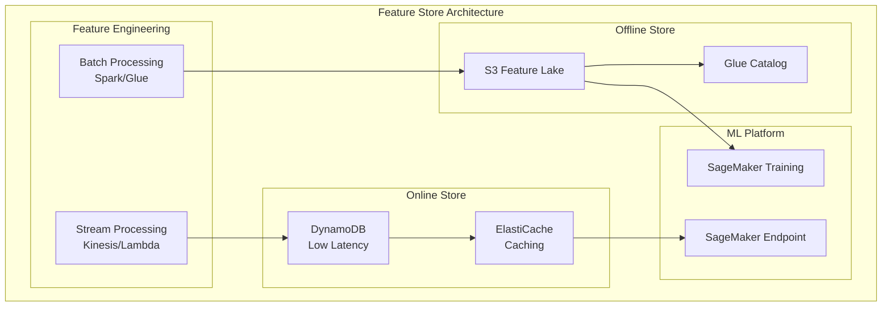

**SageMaker Feature Store Integration:**
```python
from sagemaker.feature_store.feature_group import FeatureGroup

feature_group = FeatureGroup(
    name="customer-features",
    sagemaker_session=session
)

feature_group.create(
    s3_uri=f"s3://{bucket}/features/",
    record_identifier_name="customer_id",
    event_time_feature_name="event_time",
    role_arn=sagemaker_role,
    enable_online_store=True
)
```

---

## Category 2: Scaling Challenges

### Q5: The platform needs to handle 100x traffic spikes during Black Friday. How do you prepare?

**Answer:**

**Pre-scaling strategy:**
```python
# Set minimum capacity high before event
autoscaling.register_scalable_target(
    ServiceNamespace='sagemaker',
    ResourceId='endpoint/production/variant/primary',
    ScalableDimension='sagemaker:variant:DesiredInstanceCount',
    MinCapacity=20,  # Up from normal 2
    MaxCapacity=100
)

# Aggressive scaling policy
autoscaling.put_scaling_policy(
    PolicyName='black-friday-scaling',
    ServiceNamespace='sagemaker',
    ResourceId='endpoint/production/variant/primary',
    ScalableDimension='sagemaker:variant:DesiredInstanceCount',
    PolicyType='TargetTrackingScaling',
    TargetTrackingScalingPolicyConfiguration={
        'TargetValue': 50.0,  # Lower target = more aggressive
        'PredefinedMetricSpecification': {
            'PredefinedMetricType': 'SageMakerVariantInvocationsPerInstance'
        },
        'ScaleOutCooldown': 30,  # Fast scale out
        'ScaleInCooldown': 300   # Slow scale in
    }
)
```

**Additional measures:**
1. **Warm pool instances** - Pre-provision instances
2. **Multi-variant** - Spread across instance types
3. **Caching** - ElastiCache for frequent predictions
4. **Async inference** - Queue for non-urgent requests
5. **Load testing** - Verify with synthetic load

---

### Q6: How would you handle a scenario where training jobs are queuing due to capacity limits?

**Answer:**

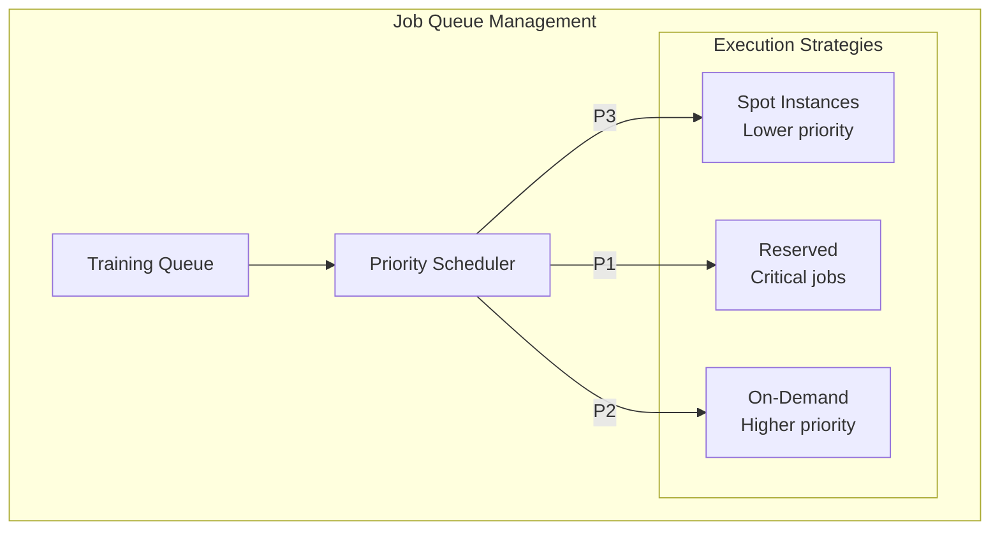

**Solutions:**

1. **Request limit increase:**
```bash
aws service-quotas request-service-quota-increase \
    --service-code sagemaker \
    --quota-code L-XXXX \
    --desired-value 50
```

2. **Multi-region distribution:**
```python
regions = ['us-east-1', 'us-west-2', 'eu-west-1']
region = select_region_with_capacity(regions)
estimator = Estimator(region=region, ...)
```

3. **Job prioritization:**
```python
class TrainingScheduler:
    def submit_job(self, job, priority):
        if priority == 'critical':
            return self.submit_on_demand(job)
        elif priority == 'normal':
            return self.submit_spot_with_fallback(job)
        else:
            return self.queue_for_later(job)
```

---

### Q7: Design an auto-scaling strategy for SageMaker endpoints that minimizes cost while meeting SLAs.

**Answer:**

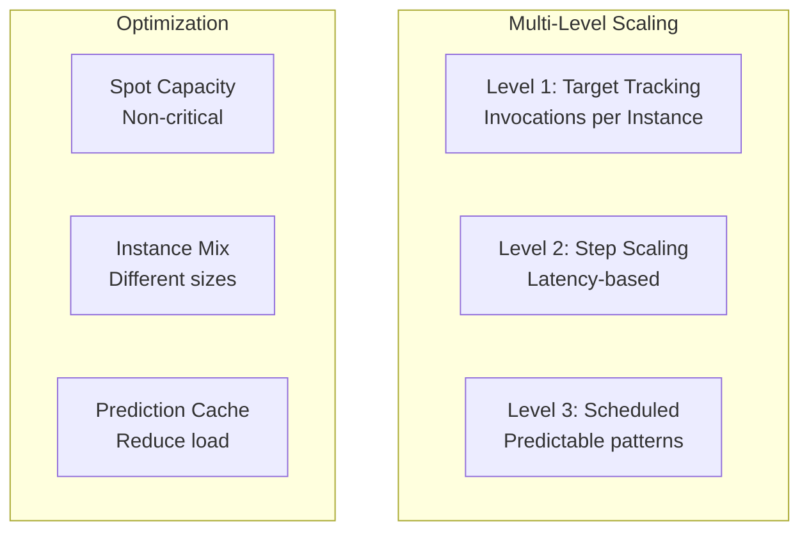

**Implementation:**
```python
# Target tracking for normal operation
autoscaling.put_scaling_policy(
    PolicyName='invocations-tracking',
    PolicyType='TargetTrackingScaling',
    TargetTrackingScalingPolicyConfiguration={
        'TargetValue': 70.0,
        'PredefinedMetricSpecification': {
            'PredefinedMetricType': 'SageMakerVariantInvocationsPerInstance'
        }
    }
)

# Step scaling for latency spikes
autoscaling.put_scaling_policy(
    PolicyName='latency-step',
    PolicyType='StepScaling',
    StepScalingPolicyConfiguration={
        'AdjustmentType': 'ChangeInCapacity',
        'StepAdjustments': [
            {'MetricIntervalLowerBound': 0, 'ScalingAdjustment': 2},
            {'MetricIntervalLowerBound': 50, 'ScalingAdjustment': 5}
        ],
        'Cooldown': 60
    }
)

# Scheduled scaling for known patterns
autoscaling.put_scheduled_action(
    ScheduledActionName='morning-scale-up',
    Schedule='cron(0 8 * * ? *)',
    ScalableTargetAction={'MinCapacity': 5}
)
```

---

## Category 3: Cost Optimization

### Q8: The ML platform costs $500K/month. Reduce it to $300K without impacting SLAs.

**Answer:**

**Cost breakdown analysis:**
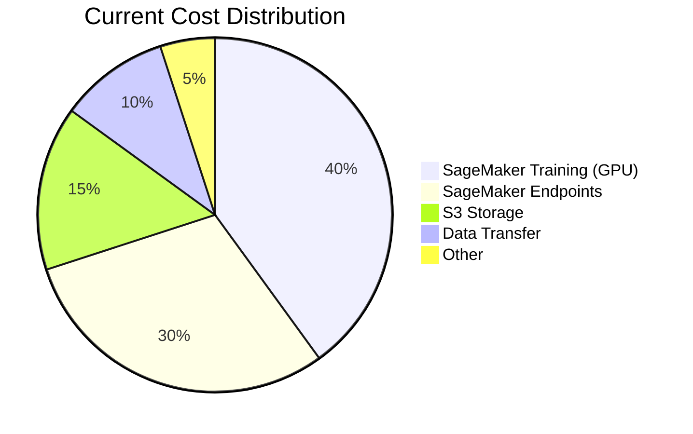

**Optimization strategies:**

| Strategy | Savings | Implementation |
|----------|---------|----------------|
| **Spot for training** | $80K | Use spot with checkpointing |
| **Right-size endpoints** | $40K | Analyze utilization, downsize |
| **S3 Intelligent Tiering** | $15K | Automatic tier management |
| **Reserved capacity** | $30K | 1-year commit for endpoints |
| **Endpoint auto-scaling** | $20K | Scale to zero at night |
| **Model optimization** | $15K | Quantization, smaller models |

**Total potential savings: $200K (40%)**

**Implementation priority:**
1. Enable Spot for all training (immediate)
2. Right-size endpoints (1 week analysis)
3. Reserved capacity (procurement process)
4. S3 lifecycle policies (immediate)

---

### Q9: Explain the trade-offs between SageMaker Spot training and On-Demand.

**Answer:**

| Factor | Spot | On-Demand |
|--------|------|-----------|
| **Cost** | 60-90% savings | Full price |
| **Availability** | May be interrupted | Always available |
| **Use case** | Fault-tolerant jobs | Critical deadlines |
| **Max duration** | Limited by interruption | Unlimited |
| **Checkpointing** | Required | Optional |

**When to use Spot:**
- Training can be restarted
- Have checkpointing enabled
- Not time-critical
- Long-running jobs (more savings)

**When to use On-Demand:**
- Strict deadline
- Short jobs (interruption impact high)
- Demo/presentation
- Production inference

**Hybrid approach:**
```python
def create_estimator(priority='normal'):
    if priority == 'critical':
        return Estimator(use_spot_instances=False)
    else:
        return Estimator(
            use_spot_instances=True,
            max_wait=7200,  # 2 hours max wait
            max_run=3600,
            checkpoint_s3_uri='s3://bucket/checkpoints/'
        )
```

---

## Category 4: Security Deep Dives

### Q10: How would you implement data lineage and audit trails for compliance (SOC2, HIPAA)?

**Answer:**

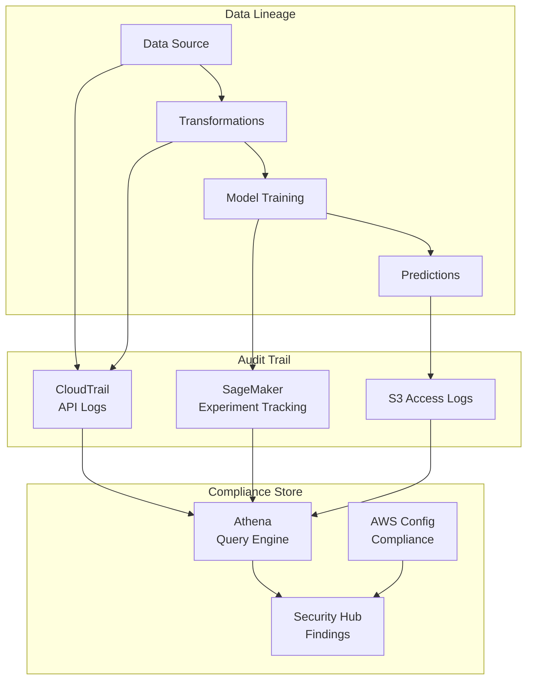

**Implementation:**

1. **CloudTrail for API auditing:**
```yaml
Trail:
  Type: AWS::CloudTrail::Trail
  Properties:
    IsMultiRegionTrail: true
    IncludeGlobalServiceEvents: true
    EnableLogFileValidation: true
    S3BucketName: !Ref AuditBucket
    EventSelectors:
      - ReadWriteType: All
        IncludeManagementEvents: true
```

2. **Data Lineage with SageMaker:**
```python
from sagemaker.lineage import LineageQuery

query = LineageQuery(sagemaker_session)
artifacts = query.query(
    start_arns=[model_arn],
    direction='Ascendants'
)
# Returns: data sources → processing → training → model
```

---

### Q11: A security audit found that IAM policies are too permissive. How do you remediate?

**Answer:**

**Current issue:** `Resource: "*"` in some policies

**Remediation steps:**

1. **Analyze current usage:**
```bash
# Use IAM Access Analyzer
aws accessanalyzer start-policy-generation \
    --policy-generation-details '{"principalArn": "arn:aws:iam::123:role/ml-platform-prod"}'
```

2. **Scope down resources:**
```json
// Before
{
  "Action": "sagemaker:*",
  "Resource": "*"
}

// After
{
  "Action": [
    "sagemaker:CreateTrainingJob",
    "sagemaker:DescribeTrainingJob"
  ],
  "Resource": [
    "arn:aws:sagemaker:*:*:training-job/ml-platform-*"
  ]
}
```

3. **Add conditions:**
```json
{
  "Condition": {
    "StringEquals": {
      "sagemaker:ResourceTag/project": "ml-platform"
    }
  }
}
```

4. **Use permission boundaries:**
```yaml
PermissionsBoundary:
  Type: AWS::IAM::ManagedPolicy
  Properties:
    PolicyDocument:
      Statement:
        - Effect: Allow
          Action: ["sagemaker:*", "s3:*", "ecr:*"]
          Resource: "*"
          Condition:
            StringEquals:
              aws:RequestedRegion: ["us-east-1"]
```

---

## Category 5: Observability & Debugging

### Q12: A model in production is returning predictions with 50% accuracy (expected 95%). How do you debug?

**Answer:**

**Debugging framework:**

```mermaid
flowchart TD
    Start[Accuracy Drop Detected]
    
    subgraph "Data Investigation"
        D1[Check input data distribution]
        D2[Compare to training data]
        D3[Identify data drift]
    end
    
    subgraph "Model Investigation"
        M1[Check model version]
        M2[Verify model artifacts]
        M3[Test with known inputs]
    end
    
    subgraph "Infrastructure Investigation"
        I1[Check endpoint config]
        I2[Verify container image]
        I3[Review recent changes]
    end
    
    Start --> D1
    D1 --> D2 --> D3
    Start --> M1
    M1 --> M2 --> M3
    Start --> I1
    I1 --> I2 --> I3
```

**Investigation steps:**

1. **Check recent deployments:**
```bash
aws sagemaker describe-endpoint --endpoint-name production
aws sagemaker describe-model --model-name $(get-current-model)
```

2. **Analyze input data:**
```python
# Compare production vs training distributions
from scipy import stats
ks_stat, p_value = stats.ks_2samp(training_data, production_data)
if p_value < 0.05:
    print("Significant data drift detected!")
```

3. **Test with known inputs:**
```python
test_cases = load_validation_set()
predictions = invoke_endpoint(test_cases)
accuracy = calculate_accuracy(predictions, test_cases.labels)
```

4. **Rollback if needed:**
```bash
aws sagemaker update-endpoint \
    --endpoint-name production \
    --endpoint-config-name previous-version-config
```

---

### Q13: Design a comprehensive monitoring dashboard for this ML platform.

**Answer:**

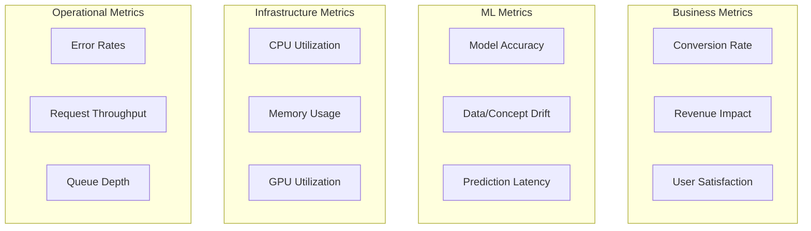

**CloudWatch Dashboard:**
```python
dashboard = cloudwatch.Dashboard(
    dashboard_name='ml-platform-comprehensive',
    widgets=[
        # Row 1: Business Impact
        TextWidget(markdown='# Business Metrics'),
        MetricWidget('ConversionRate'),
        MetricWidget('RevenueImpact'),
        
        # Row 2: Model Performance
        TextWidget(markdown='# Model Metrics'),
        GraphWidget(title='Accuracy over Time'),
        GraphWidget(title='Data Drift Score'),
        
        # Row 3: Latency
        GraphWidget(title='P50/P90/P99 Latency'),
        GraphWidget(title='Invocations per Minute'),
        
        # Row 4: Infrastructure
        GraphWidget(title='CPU/Memory/GPU'),
        GraphWidget(title='Instance Count'),
        
        # Row 5: Alerts
        AlarmStatusWidget(alarms=[...])
    ]
)
```

---

## Category 6: Architecture Evolution

### Q14: How would you migrate this platform from CloudFormation to Terraform?

**Answer:**

**Migration strategy:**

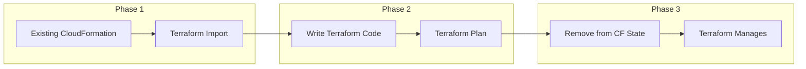

**Steps:**

1. **Import existing resources:**
```bash
terraform import aws_s3_bucket.artifact_store ml-platform-prod-123456789012
terraform import aws_ecr_repository.registry ml-platform-prod
terraform import aws_iam_role.stack_role ml-platform-prod
```

2. **Write Terraform code:**
```hcl
resource "aws_s3_bucket" "artifact_store" {
  bucket = "${var.resource_name}-${data.aws_caller_identity.current.account_id}"
  
  tags = {
    Project = var.tag_value
  }
}

resource "aws_ecr_repository" "registry" {
  name = var.resource_name
}

resource "aws_iam_role" "stack_role" {
  name = var.resource_name
  assume_role_policy = data.aws_iam_policy_document.assume_role.json
}
```

3. **Verify with plan:**
```bash
terraform plan
# Should show no changes if import was correct
```

**Why migrate:**
- Better state management
- Module reusability
- Multi-cloud support
- Stronger community

---

### Q15: Design a self-service ML platform where data scientists can deploy without DevOps involvement.

**Answer:**

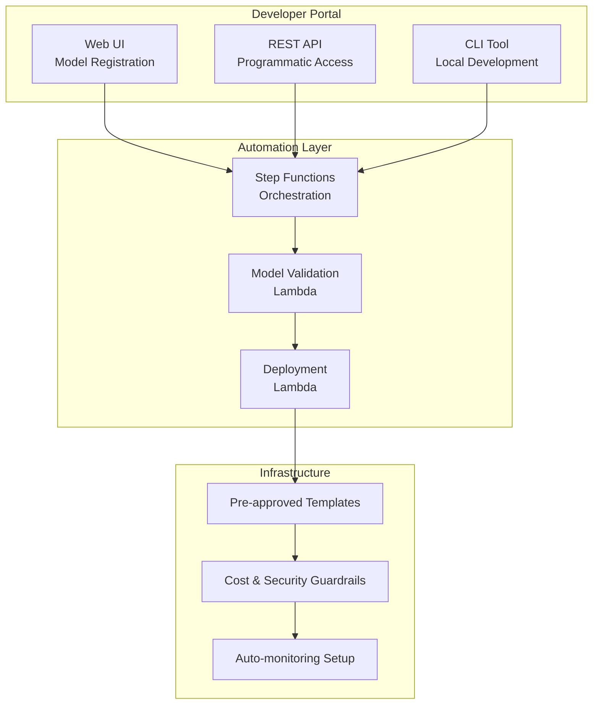

**Key components:**

1. **Pre-approved templates** with security built-in
2. **Guardrails** for cost/resource limits
3. **Automated validation** (model format, size, performance)
4. **Standard monitoring** setup included
5. **Rollback automation** for failures

---

## Category 7: Behavioral/Leadership

### Q16: Tell me about a time when you had to make a difficult architecture decision with incomplete information.

**Answer (STAR Format):**

**Situation:** 
At Amazon, we needed to choose between SageMaker and a custom Kubernetes-based ML platform. The decision would affect 50+ data scientists and $2M annual budget.

**Task:**
Make a recommendation within 2 weeks, with limited time for proof-of-concept.

**Action:**
1. Created decision matrix with weighted criteria
2. Consulted with data scientists on pain points
3. Built minimal PoC for both options
4. Analyzed TCO over 3 years
5. Presented trade-offs to leadership

**Result:**
- Chose SageMaker (lower operational burden)
- Saved 40% on infrastructure costs
- 3x faster time-to-deployment for data scientists
- Decision validated after 1 year in production

---

### Q17: How do you balance technical debt with feature delivery?

**Answer:**

**Framework I use:**

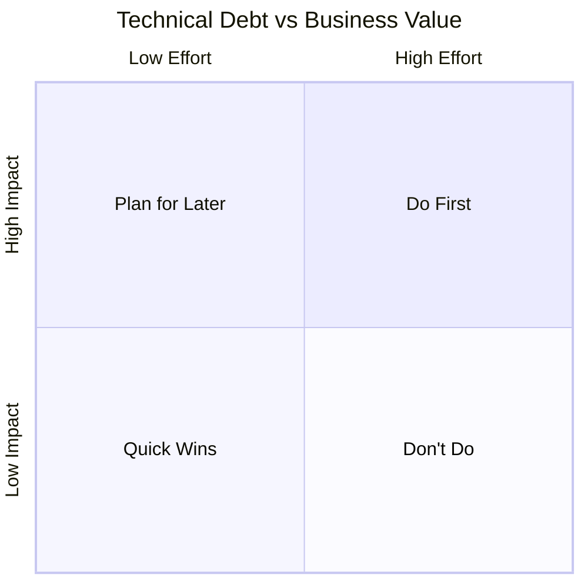

**Practical approach:**
1. **20% rule**: Allocate 20% of each sprint to tech debt
2. **Track debt**: Maintain backlog with estimated impact
3. **Quantify impact**: Connect debt to metrics (latency, errors)
4. **Communicate**: Show leadership the cost of inaction
5. **Incremental improvement**: Refactor while adding features

---

## 🎯 Summary: Key Points to Remember

1. **Always discuss trade-offs** - No solution is perfect
2. **Quantify impact** - Use numbers and metrics
3. **Think about scale** - What happens at 10x, 100x?
4. **Security first** - Least privilege, encryption, audit
5. **Cost awareness** - Every architecture decision has cost implications
6. **Show leadership** - Demonstrate you can make decisions and own outcomes
