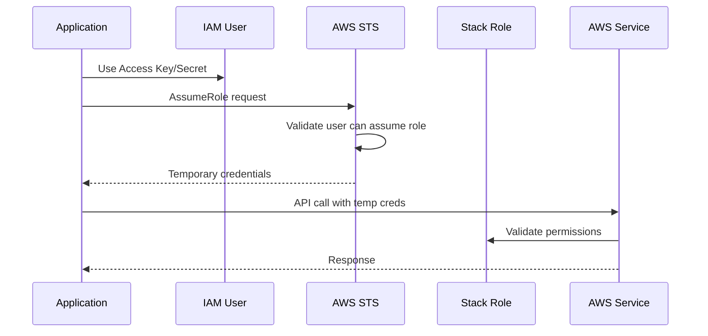
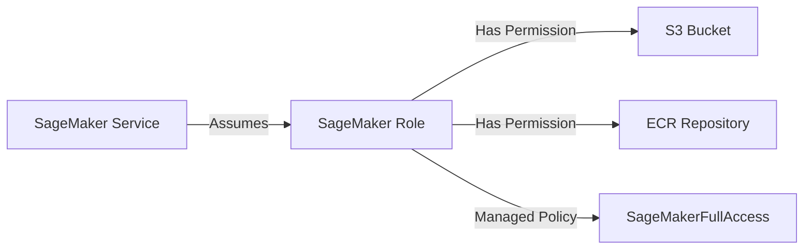
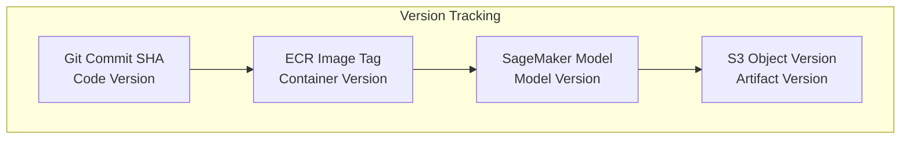
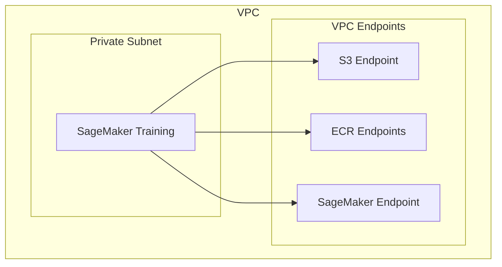

# 📙 Medium Interview Questions

## Category 1: Integration Scenarios

### Q1: How does the IAM role assumption chain work in this architecture?

**Answer:**


**Why this pattern:**
- IAM User has ONLY `sts:AssumeRole` permission
- All actual permissions are in the role
- Temporary credentials expire (security)
- Easy to audit and rotate
- Follows AWS best practices

---

### Q2: Explain how the Lambda function registers the stack with ZenML.

**Answer:**
**Trigger:** CloudFormation Custom Resource

**Process:**
1. CloudFormation invokes Lambda on stack create
2. Lambda reads stack outputs and parameters
3. Lambda constructs JSON payload with:
   - Service connector config (AWS credentials)
   - Component configs (S3, ECR, SageMaker, CodeBuild)
4. Lambda POSTs to ZenML API
5. Lambda returns SUCCESS/FAILED to CloudFormation

**Error Handling:**
```python
try:
    response = urllib.request.urlopen(req)
    if response.getcode() == 200:
        send_response(event, context, 'SUCCESS', {...})
    else:
        send_response(event, context, 'FAILED', {...})
except Exception as e:
    send_response(event, context, 'FAILED', {'Message': str(e)})
```

---

### Q3: How does SageMaker access S3 and ECR during training?

**Answer:**
**IAM Role Flow:**


**Key Permissions:**
- `s3:GetObject` - Download training data
- `s3:PutObject` - Upload model artifacts
- `ecr:GetDownloadUrlForLayer` - Pull container image
- `ecr:BatchGetImage` - Get image manifest

**Trust Policy:**
```json
{
  "Principal": {"Service": "sagemaker.amazonaws.com"},
  "Action": "sts:AssumeRole"
}
```

---

### Q4: What's the difference between Stack Access Role and SageMaker Role?

**Answer:**
| Aspect | Stack Access Role | SageMaker Role |
|--------|-------------------|----------------|
| **Assumed by** | IAM User (via STS) | SageMaker service |
| **Purpose** | Operational access | ML execution |
| **Scope** | Create/monitor jobs | Run training/inference |
| **Duration** | Session-based | Job lifetime |
| **PassRole** | Can pass SM role | N/A |

**Separation of concerns:**
- Developer assumes Stack Role to start training
- Stack Role passes SageMaker Role to training job
- SageMaker Role is used during actual execution

---

## Category 2: Troubleshooting Scenarios

### Q5: A training job failed with "ResourceNotFound" for the Docker image. How do you debug?

**Answer:**
**Step 1: Verify image exists**
```bash
aws ecr describe-images \
  --repository-name ml-platform-prod \
  --image-ids imageTag=latest
```

**Step 2: Check image URI format**
```
{account}.dkr.ecr.{region}.amazonaws.com/{repo}:{tag}
```

**Step 3: Verify IAM permissions**
```bash
aws iam simulate-principal-policy \
  --policy-source-arn arn:aws:iam::123456789012:role/ml-platform-prod-sagemaker \
  --action-names ecr:GetDownloadUrlForLayer
```

**Step 4: Check ECR authentication**
- Token expired? Refresh with `get-login-password`
- VPC endpoints configured if in private subnet?

**Common causes:**
- Wrong region in URI
- Image tag doesn't exist
- IAM role missing ECR permissions
- ECR repository in different account

---

### Q6: CodeBuild is timing out. What are the potential causes and fixes?

**Answer:**
**Potential Causes:**

1. **Docker layer caching** - Pulling large base images
2. **Dependency installation** - pip install taking too long
3. **Large context** - Uploading too much to S3
4. **Network issues** - VPC/NAT gateway problems

**Fixes:**

```yaml
# 1. Use smaller base images
FROM python:3.9-slim  # Instead of python:3.9

# 2. Cache dependencies
COPY requirements.txt .
RUN pip install --no-cache-dir -r requirements.txt
COPY . .

# 3. Use multi-stage builds
FROM python:3.9 AS builder
# ... install dependencies
FROM python:3.9-slim
COPY --from=builder ...
```

**Increase timeout:**
```yaml
TimeoutInMinutes: 30  # Default is 20
```

---

### Q7: ZenML stack registration fails with "Connection refused". How do you troubleshoot?

**Answer:**
**Checklist:**

1. **Verify ZenML server URL:**
   ```bash
   curl -I https://zenml.example.com/health
   ```

2. **Check Lambda network access:**
   - Lambda in VPC? Need NAT Gateway
   - Security groups allow outbound HTTPS?

3. **Validate API token:**
   ```bash
   curl -H "Authorization: Bearer $TOKEN" \
     https://zenml.example.com/api/v1/workspaces/default
   ```

4. **Check CloudWatch Logs:**
   ```bash
   aws logs get-log-events \
     --log-group-name /aws/lambda/ml-platform-prod \
     --log-stream-name '<latest>'
   ```

5. **Verify SSL certificate:**
   - Self-signed cert? Lambda may reject
   - Add to Lambda environment or use CA bundle

---

### Q8: S3 PutObject is failing with "Access Denied". What do you check?

**Answer:**
**Debug Steps:**

1. **Verify bucket policy allows access:**
   ```bash
   aws s3api get-bucket-policy --bucket ml-platform-prod-123456789012
   ```

2. **Check IAM role permissions:**
   ```bash
   aws iam get-role-policy \
     --role-name ml-platform-prod \
     --policy-name S3Policy
   ```

3. **Verify bucket name matches policy:**
   - Policy references `${S3Bucket.Arn}`
   - Is the request going to the right bucket?

4. **Check for bucket-level encryption requirements:**
   - KMS key access needed?

5. **Verify path prefix:**
   - Policy might restrict to specific prefixes
   - Check Resource ARN patterns

---

## Category 3: Design Decisions

### Q9: Why use IAM User with Access Keys instead of just IAM Roles?

**Answer:**
**Trade-off Analysis:**

| Approach | Pros | Cons |
|----------|------|------|
| **IAM User + Role** | Works outside AWS, Simple setup | Long-term credentials |
| **IAM Role only** | More secure, No keys to rotate | Only works in AWS |
| **OIDC Federation** | No AWS credentials | Complex setup |

**Our choice rationale:**
- ZenML server may run anywhere (not just AWS)
- Need programmatic access from external systems
- Role assumption adds security layer
- User only has `sts:AssumeRole` permission

**Mitigation:**
- Rotate access keys regularly
- Monitor with CloudTrail
- Use IAM policy conditions (IP, MFA)

---

### Q10: Why did you choose CodeBuild over GitHub Actions or Jenkins for image building?

**Answer:**
| Criteria | CodeBuild | GitHub Actions | Jenkins |
|----------|-----------|----------------|---------|
| **AWS Integration** | Native | Requires setup | Requires setup |
| **Cost** | Pay per build | Free tier, then $$$ | Self-hosted cost |
| **Security** | IAM native | Secrets management | Plugin dependent |
| **Scalability** | Managed | Managed | Self-managed |
| **Complexity** | Low | Medium | High |

**Why CodeBuild:**
- Native IAM for ECR/S3 access
- No credentials to configure
- Pay-per-use (cost effective)
- Managed scaling
- CloudWatch integration

---

### Q11: Why use SageMaker instead of EKS for ML training?

**Answer:**
| Criteria | SageMaker | EKS |
|----------|-----------|-----|
| **Setup complexity** | Low | High |
| **Operational burden** | Managed | Self-managed |
| **Cost model** | Per-job | Per-cluster |
| **GPU support** | Native | Manual config |
| **Scaling** | Per-job | Cluster-level |
| **Frameworks** | Built-in | Custom |

**SageMaker wins when:**
- Team is small (don't want cluster management)
- Workloads are bursty (pay-per-use)
- Need quick GPU access
- Want managed experiment tracking

**EKS wins when:**
- Already have K8s expertise
- Need custom orchestration
- Want to avoid vendor lock-in
- Running mixed workloads

---

### Q12: How would you implement model versioning in this architecture?

**Answer:**
**Multi-layered versioning:**



**Implementation:**
1. **Git tag** model code versions
2. **ECR image tag** includes git SHA
3. **S3 versioning** enabled on bucket
4. **SageMaker Model Registry** for production models

**Naming convention:**
```
model-name-v{major}.{minor}.{patch}-{git-sha}
```

---

## Category 4: Optimization

### Q13: How would you reduce SageMaker training costs by 50%?

**Answer:**
**Strategy 1: Spot Instances (Up to 90% savings)**
```python
estimator = Estimator(
    use_spot_instances=True,
    max_wait=7200,  # Max time including spot delays
    max_run=3600,   # Actual training time
    checkpoint_s3_uri="s3://bucket/checkpoints"
)
```

**Strategy 2: Right-sizing**
- Start with small instance, scale based on metrics
- Use CloudWatch metrics to identify bottlenecks
- ml.m5.large often sufficient for small models

**Strategy 3: Managed Warm Pools**
```python
estimator = Estimator(
    keep_alive_period_in_seconds=3600  # Reuse instances
)
```

**Strategy 4: Data optimization**
- Use Pipe mode instead of File mode for large datasets
- Convert to efficient formats (Parquet, TFRecord)

---

### Q14: How would you reduce inference latency from 200ms to 50ms?

**Answer:**
**Strategy 1: Instance selection**
- Use compute-optimized instances (c5, c6i)
- Consider Inferentia for deep learning

**Strategy 2: Model optimization**
- Quantization (FP16 or INT8)
- Model pruning
- TensorRT compilation
- Batch inference

**Strategy 3: Endpoint configuration**
```python
endpoint_config = {
    "ProductionVariants": [{
        "InitialInstanceCount": 2,  # Spread load
        "ModelDataDownloadTimeoutInSeconds": 60,
        "ContainerStartupHealthCheckTimeoutInSeconds": 60
    }]
}
```

**Strategy 4: Caching**
- ElastiCache for frequent predictions
- Feature store for pre-computed features

---

## Category 5: Security Scenarios

### Q15: How do you rotate credentials in this setup?

**Answer:**
**Access Key Rotation:**
```bash
# 1. Create new access key
aws iam create-access-key --user-name ml-platform-prod

# 2. Update applications with new key

# 3. Wait for propagation

# 4. Delete old access key
aws iam delete-access-key \
  --user-name ml-platform-prod \
  --access-key-id OLD_KEY_ID
```

**Automated rotation with Secrets Manager:**
```yaml
# Add to CloudFormation
RotationSchedule:
  Type: AWS::SecretsManager::RotationSchedule
  Properties:
    SecretId: !Ref AccessKeySecret
    RotationRules:
      AutomaticallyAfterDays: 90
```

---

### Q16: A developer requests admin access to debug a failed training job. How do you handle this?

**Answer:**
**Never grant admin access. Instead:**

1. **Grant scoped read access:**
   ```json
   {
     "Effect": "Allow",
     "Action": [
       "sagemaker:DescribeTrainingJob",
       "logs:GetLogEvents",
       "s3:GetObject"
     ],
     "Resource": ["specific-job-arn", "specific-log-arn"]
   }
   ```

2. **Time-bound access:**
   ```json
   "Condition": {
     "DateLessThan": {"aws:CurrentTime": "2024-12-08T00:00:00Z"}
   }
   ```

3. **Require MFA:**
   ```json
   "Condition": {"Bool": {"aws:MultiFactorAuthPresent": "true"}}
   ```

4. **Audit the access:**
   - Enable CloudTrail
   - Review access with Access Analyzer

---

### Q17: How do you ensure data encryption at rest and in transit?

**Answer:**
**At Rest:**
| Service | Encryption | Configuration |
|---------|------------|---------------|
| S3 | SSE-S3 or SSE-KMS | Default enabled |
| ECR | AES-256 | Automatic |
| SageMaker | EBS encryption | Instance config |

**In Transit:**
| Flow | Encryption |
|------|------------|
| S3 access | HTTPS enforced |
| ECR pulls | HTTPS |
| SageMaker API | TLS 1.2+ |
| Training data | VPC endpoints |

**Best Practice:** Use VPC endpoints for private traffic:
```yaml
VPCEndpoint:
  Type: AWS::EC2::VPCEndpoint
  Properties:
    ServiceName: com.amazonaws.region.s3
    VpcId: !Ref VPC
```

---

### Q18: How would you implement network isolation for training jobs?

**Answer:**


**Implementation:**
```python
estimator = Estimator(
    subnets=['subnet-xxx'],
    security_group_ids=['sg-yyy'],
    enable_network_isolation=True  # No internet access
)
```

---

## Category 6: Monitoring & Observability

### Q19: What metrics would you monitor for this ML Platform?

**Answer:**
| Category | Metric | Threshold |
|----------|--------|-----------|
| **Training** | Job duration | < 4 hours |
| **Training** | Job success rate | > 95% |
| **Inference** | Endpoint latency P99 | < 200ms |
| **Inference** | Invocations per second | Alert on spikes |
| **Inference** | Model errors | < 1% |
| **Build** | CodeBuild duration | < 15 min |
| **Build** | Build success rate | > 99% |
| **Cost** | Daily spend | Budget alerts |

**CloudWatch Dashboard:**
```python
dashboard = cloudwatch.Dashboard(
    dashboard_name="ml-platform",
    widgets=[
        GraphWidget(title="Endpoint Latency", ...),
        GraphWidget(title="Training Jobs", ...),
        AlarmWidget(title="Critical Alarms", ...)
    ]
)
```

---

### Q20: How do you set up alerting for training job failures?

**Answer:**
```yaml
# CloudWatch Alarm
TrainingJobFailureAlarm:
  Type: AWS::CloudWatch::Alarm
  Properties:
    AlarmName: sagemaker-training-failures
    MetricName: TrainingJobFailures
    Namespace: AWS/SageMaker
    Statistic: Sum
    Period: 300
    EvaluationPeriods: 1
    Threshold: 1
    AlarmActions:
      - !Ref SNSTopic
```

**EventBridge Rule:**
```yaml
TrainingJobRule:
  Type: AWS::Events::Rule
  Properties:
    EventPattern:
      source: ["aws.sagemaker"]
      detail-type: ["SageMaker Training Job State Change"]
      detail:
        TrainingJobStatus: ["Failed"]
    Targets:
      - Arn: !Ref SNSTopic
```

---

## 🔗 Next Level
Continue to **[Hard Questions](./hard-questions.md)** for senior/architect level challenges.
