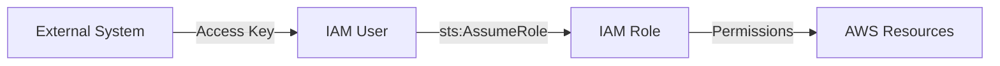
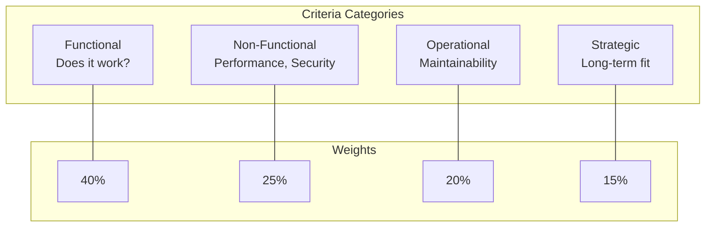

# 🏛️ Architect Decisions

## Overview

This document captures the key architectural decisions made while designing and implementing the ML Platform at Amazon. Each decision is documented using the Architecture Decision Record (ADR) format.

---

## ADR Index

| ADR | Title | Status | Date |
|-----|-------|--------|------|
| ADR-001 | Use CloudFormation for Infrastructure | Accepted | 2024-01 |
| ADR-002 | Use ECR over Docker Hub | Accepted | 2024-01 |
| ADR-003 | Use SageMaker for ML Operations | Accepted | 2024-01 |
| ADR-004 | IAM Role Assumption Pattern | Accepted | 2024-02 |
| ADR-005 | CodeBuild for Image Building | Accepted | 2024-02 |
| ADR-006 | ZenML for Pipeline Orchestration | Accepted | 2024-03 |

---

## ADR-001: Use CloudFormation for Infrastructure

### Context
We needed to provision and manage AWS infrastructure for the ML platform in a reproducible and auditable manner.

### Decision
Use AWS CloudFormation with SAM transform for infrastructure provisioning.

### Alternatives Considered

| Option | Pros | Cons |
|--------|------|------|
| **CloudFormation** | Native AWS, no extra tooling | AWS-only, YAML verbose |
| **Terraform** | Multi-cloud, better state | Extra tooling, learning curve |
| **CDK** | Type-safe, reusable | Compilation step, complexity |
| **Pulumi** | Real programming languages | Less mature, smaller community |

### Rationale
- Native AWS integration (no credential bridging)
- Automatic rollback on failures
- SAM transform for serverless simplicity
- Team already has CloudFormation expertise
- Direct console access for debugging

### Consequences
- ✅ Simple deployment via AWS Console or CLI
- ✅ Automatic dependency ordering
- ⚠️ Limited to AWS (acceptable for our use case)
- ⚠️ YAML can be verbose

---

## ADR-002: Use ECR over Docker Hub

### Context
ML pipelines require container images for training and inference. We needed a secure, reliable container registry.

### Decision
Use Amazon ECR as the container registry.

### Alternatives Considered

| Option | Pros | Cons |
|--------|------|------|
| **ECR** | Native IAM, AWS integration | AWS-only |
| **Docker Hub** | Popular, easy | Rate limits, security concerns |
| **GitHub Container Registry** | CI integration | Another credential to manage |
| **Self-hosted** | Full control | Operational burden |

### Rationale
- Native IAM integration (no separate credentials)
- Automatic integration with SageMaker
- Image scanning for vulnerabilities
- Private by default
- High availability within AWS

### Consequences
- ✅ Seamless authentication with IAM
- ✅ No rate limiting concerns
- ✅ Native SageMaker integration
- ⚠️ Images not portable outside AWS without extra steps

---

## ADR-003: Use SageMaker for ML Operations

### Context
We needed a platform for training ML models and serving predictions at scale.

### Decision
Use AWS SageMaker for training jobs, pipelines, and inference endpoints.

### Alternatives Considered

| Option | Pros | Cons |
|--------|------|------|
| **SageMaker** | Managed, integrated | Vendor lock-in |
| **EKS + Kubeflow** | Portable, flexible | High operational burden |
| **Vertex AI** | Good ML features | Different cloud |
| **Ray** | Flexible, OSS | Self-managed |

### Rationale
- Fully managed (no cluster maintenance)
- Built-in experiment tracking
- Native GPU support
- Pay-per-use for training
- Auto-scaling for endpoints
- Team focus on ML, not infra

### Consequences
- ✅ Reduced operational burden
- ✅ Faster time to production
- ✅ Cost-effective for bursty workloads
- ⚠️ Some vendor lock-in
- ⚠️ Learning SageMaker specifics

---

## ADR-004: IAM Role Assumption Pattern

### Context
External systems (ZenML, CI/CD) need secure access to AWS resources.

### Decision
Use IAM User with minimal permissions that assumes an IAM Role for operations.

### Pattern

### Rationale
- IAM User has ONLY `sts:AssumeRole`
- All permissions defined in Role
- Temporary credentials (more secure)
- Easy to audit and rotate
- Works from outside AWS

### Consequences
- ✅ Minimal blast radius if keys compromised
- ✅ Temporary credentials expire
- ✅ Clear separation of identity vs permissions
- ⚠️ Extra STS call for each session
- ⚠️ Must handle credential refresh

---

## ADR-005: CodeBuild for Image Building

### Context
ML pipeline images need to be built and pushed to ECR.

### Decision
Use AWS CodeBuild as an optional image builder (configurable via parameter).

### Alternatives Considered

| Option | Pros | Cons |
|--------|------|------|
| **CodeBuild** | Native AWS, managed | AWS-only |
| **Local Docker** | Simple, fast iteration | Not scalable, security |
| **GitHub Actions** | CI integration | Credential management |
| **Kaniko** | Kubernetes native | Requires K8s cluster |

### Rationale
- Native IAM for ECR authentication
- No Docker daemon needed on client
- Parallel builds supported
- Pay-per-build pricing
- CloudWatch integration for logs

### Consequences
- ✅ Secure builds (no local Docker)
- ✅ Scalable for team usage
- ✅ Integrated logging
- ⚠️ Slower than local builds
- ⚠️ Build definition in buildspec.yml

---

## ADR-006: ZenML for Pipeline Orchestration

### Context
Need to orchestrate ML pipelines across different compute environments.

### Decision
Integrate with ZenML server for pipeline orchestration and stack management.

### Alternatives Considered

| Option | Pros | Cons |
|--------|------|------|
| **ZenML** | Portable, flexible | Learning curve |
| **SageMaker Pipelines** | Native AWS | Less portable |
| **Airflow** | Widely used | General purpose, heavy |
| **Prefect** | Modern, Pythonic | Less ML-specific |
| **Kubeflow** | K8s native | Requires K8s |

### Rationale
- Write once, run anywhere
- Clean abstraction over infrastructure
- Artifact tracking built-in
- Growing community and integrations
- Fits our multi-cloud strategy

### Consequences
- ✅ Portable pipelines
- ✅ Clean separation of concerns
- ✅ Artifact lineage tracking
- ⚠️ Additional component to manage
- ⚠️ Team needs ZenML training

---

## Decision Framework

When making architecture decisions, we use this framework:

### Evaluation Criteria

### Decision Matrix Template

| Criteria | Weight | Option A | Option B | Option C |
|----------|--------|----------|----------|----------|
| Functionality | 40% | 8 | 7 | 9 |
| Performance | 10% | 7 | 9 | 8 |
| Security | 15% | 9 | 7 | 8 |
| Cost | 10% | 6 | 8 | 7 |
| Maintainability | 15% | 8 | 6 | 7 |
| Team Expertise | 10% | 9 | 5 | 6 |
| **Weighted Score** | 100% | **7.85** | **6.85** | **7.65** |

---

## Future Considerations

### Potential Changes to Evaluate

1. **Multi-region deployment** - For DR and latency
2. **Terraform migration** - For multi-cloud support
3. **Feature store integration** - For feature management
4. **Model registry** - For model governance
5. **MLflow integration** - For experiment tracking

### Triggers for Re-evaluation

- Team grows beyond 10 ML engineers
- Multi-cloud requirement emerges
- Compliance requirements change
- Cost exceeds $1M/year
- SLA requirements increase

---

## 🔗 Related Documents

- [Architecture Overview](../02-architecture/README.md)
- [HLD](../02-architecture/HLD.md)
- [Best Practices](../07-best-practices/README.md)
