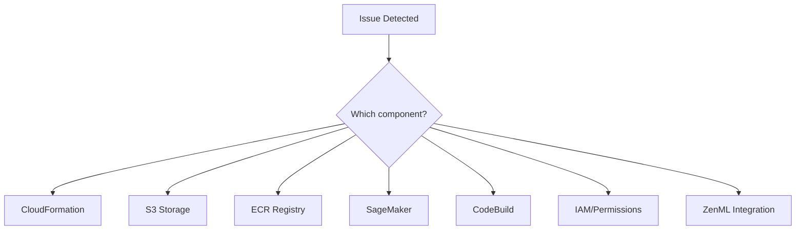

# 🔧 Troubleshooting Guide

## Overview

This guide covers common issues encountered with the ML Platform and their solutions. Issues are organized by component for quick reference.

---

## Quick Diagnostic Checklist



---

## 1. CloudFormation Issues

### Issue: Stack creation fails with "CREATE_FAILED"

**Symptoms:**
- Stack status shows CREATE_FAILED
- Resources partially created

**Diagnosis:**
```bash
# Get detailed events
aws cloudformation describe-stack-events \
  --stack-name zenml-ml-platform \
  --query 'StackEvents[?ResourceStatus==`CREATE_FAILED`]'
```

**Common Causes & Solutions:**

| Cause | Solution |
|-------|----------|
| Resource name conflict | Use unique ResourceName parameter |
| Missing CAPABILITY_NAMED_IAM | Add `--capabilities CAPABILITY_NAMED_IAM` |
| Service quota exceeded | Request quota increase |
| Invalid parameter | Check parameter constraints |

---

### Issue: Stack update fails with "UPDATE_ROLLBACK_COMPLETE"

**Symptoms:**
- Update fails and rolls back
- Stack in UPDATE_ROLLBACK_COMPLETE state

**Solution:**
```bash
# 1. Check what failed
aws cloudformation describe-stack-events \
  --stack-name zenml-ml-platform | grep FAILED

# 2. Fix the issue in template

# 3. Retry update
aws cloudformation update-stack \
  --stack-name zenml-ml-platform \
  --template-body file://template.yaml \
  --capabilities CAPABILITY_NAMED_IAM
```

---

### Issue: Stack stuck in DELETE_IN_PROGRESS

**Cause:** Resources have dependencies or contain data

**Solution:**
```bash
# Check which resource is stuck
aws cloudformation describe-stack-events \
  --stack-name zenml-ml-platform

# If S3 bucket not empty
aws s3 rm s3://bucket-name --recursive

# Force delete with retain
aws cloudformation delete-stack \
  --stack-name zenml-ml-platform \
  --retain-resources S3Bucket
```

---

## 2. S3 Issues

### Issue: "Access Denied" when accessing S3

**Diagnosis:**
```bash
# Check bucket exists
aws s3 ls | grep ml-platform

# Check IAM permissions
aws iam simulate-principal-policy \
  --policy-source-arn arn:aws:iam::123456789012:role/ml-platform-prod \
  --action-names s3:GetObject \
  --resource-arns arn:aws:s3:::bucket-name/*
```

**Solutions:**

1. **Wrong bucket name:**
   ```bash
   # Bucket includes account ID
   aws s3 ls s3://ml-platform-prod-123456789012/
   ```

2. **Role not assumed:**
   ```bash
   # Assume role first
   aws sts assume-role \
     --role-arn arn:aws:iam::123456789012:role/ml-platform-prod \
     --role-session-name debug-session
   ```

3. **Bucket policy blocking:**
   ```bash
   aws s3api get-bucket-policy --bucket bucket-name
   ```

---

### Issue: "SlowDown" errors from S3

**Cause:** Request rate exceeded

**Solutions:**
- Use exponential backoff in code
- Spread objects across prefixes
- Request rate limit increase
- Enable S3 Transfer Acceleration

---

## 3. ECR Issues

### Issue: Docker push fails with "no basic auth credentials"

**Solution:**
```bash
# Get new authentication token
aws ecr get-login-password --region eu-central-1 | \
  docker login --username AWS --password-stdin \
  123456789012.dkr.ecr.eu-central-1.amazonaws.com

# Token valid for 12 hours
```

---

### Issue: "RepositoryNotFoundException" 

**Diagnosis:**
```bash
# List available repositories
aws ecr describe-repositories

# Check correct region
aws ecr describe-repositories --region eu-central-1
```

**Solution:**
Verify repository name matches CloudFormation resource name.

---

### Issue: Image pull fails in SageMaker

**Diagnosis:**
```bash
# Check SageMaker role has ECR permissions
aws iam get-role-policy \
  --role-name ml-platform-prod-sagemaker \
  --policy-name SageMakerRuntimePolicy
```

**Required permissions:**
- `ecr:GetDownloadUrlForLayer`
- `ecr:BatchGetImage`
- `ecr:BatchCheckLayerAvailability`
- `ecr:GetAuthorizationToken`

---

## 4. SageMaker Issues

### Issue: Training job fails with "ResourceNotFound"

**Common Causes:**

1. **S3 path doesn't exist:**
   ```bash
   aws s3 ls s3://bucket/data/training/
   ```

2. **ECR image not found:**
   ```bash
   aws ecr describe-images \
     --repository-name ml-platform-prod \
     --image-ids imageTag=latest
   ```

3. **Wrong region in image URI:**
   ```
   # Correct format
   123456789012.dkr.ecr.eu-central-1.amazonaws.com/repo:tag
   ```

---

### Issue: Training job fails with "AlgorithmError"

**Diagnosis:**
```bash
# Get training job logs
aws logs get-log-events \
  --log-group-name /aws/sagemaker/TrainingJobs \
  --log-stream-name training-job-name/algo-1-1234567890
```

**Common Causes:**
- Code error in training script
- Missing dependencies in container
- Data format mismatch
- Out of memory (try larger instance)

---

### Issue: Endpoint creation fails

**Diagnosis:**
```bash
aws sagemaker describe-endpoint \
  --endpoint-name endpoint-name

# Check endpoint config
aws sagemaker describe-endpoint-config \
  --endpoint-config-name config-name
```

**Common Causes:**
- Model artifact not found in S3
- Container image not accessible
- Instance type not available
- IAM role missing permissions

---

### Issue: High latency on endpoint

**Diagnosis:**
```bash
# Check CloudWatch metrics
aws cloudwatch get-metric-statistics \
  --namespace AWS/SageMaker \
  --metric-name ModelLatency \
  --dimensions Name=EndpointName,Value=endpoint-name \
  --start-time 2024-01-01T00:00:00Z \
  --end-time 2024-01-01T01:00:00Z \
  --period 60 \
  --statistics Average
```

**Solutions:**
- Use faster instance type
- Enable model compilation (Neo)
- Implement caching
- Optimize model (quantization)

---

## 5. CodeBuild Issues

### Issue: Build times out

**Current timeout:** 20 minutes

**Solutions:**
1. Increase timeout in CloudFormation
2. Optimize Dockerfile (multi-stage builds)
3. Use smaller base images
4. Leverage layer caching

```yaml
# Updated template
TimeoutInMinutes: 30
```

---

### Issue: Build fails with "AccessDeniedException"

**Diagnosis:**
```bash
# Check CodeBuild role permissions
aws iam get-role-policy \
  --role-name ml-platform-prod-codebuild \
  --policy-name CodeBuildPolicy
```

**Required Permissions:**
- S3: GetObject, GetObjectVersion
- ECR: Push permissions
- Logs: CreateLogStream, PutLogEvents

---

### Issue: Docker build fails in CodeBuild

**Diagnosis:**
```bash
# Check CloudWatch logs
aws logs get-log-events \
  --log-group-name /aws/codebuild/ml-platform-prod \
  --log-stream-name <build-id>
```

**Common Causes:**
- Base image not accessible
- Dockerfile syntax error
- Build context too large
- Memory exceeded

---

## 6. IAM Issues

### Issue: "Access Denied" with correct permissions

**Checklist:**
1. Correct role assumed?
2. Session credentials expired?
3. Resource ARN correct?
4. Condition keys satisfied?

**Debug:**
```bash
# Check current identity
aws sts get-caller-identity

# Test specific permission
aws iam simulate-principal-policy \
  --policy-source-arn <role-arn> \
  --action-names <action> \
  --resource-arns <resource-arn>
```

---

### Issue: sts:AssumeRole fails

**Common Causes:**

1. **Trust policy doesn't allow:**
   ```bash
   aws iam get-role --role-name ml-platform-prod \
     --query 'Role.AssumeRolePolicyDocument'
   ```

2. **MFA required but not provided:**
   ```bash
   aws sts assume-role \
     --role-arn arn:aws:iam::123:role/role-name \
     --role-session-name session \
     --serial-number arn:aws:iam::123:mfa/user \
     --token-code 123456
   ```

---

## 7. ZenML Integration Issues

### Issue: Stack registration fails

**Diagnosis:**
```bash
# Check Lambda logs
aws logs get-log-events \
  --log-group-name /aws/lambda/ml-platform-prod \
  --log-stream-name $(aws logs describe-log-streams \
    --log-group-name /aws/lambda/ml-platform-prod \
    --order-by LastEventTime \
    --descending \
    --limit 1 \
    --query 'logStreams[0].logStreamName' \
    --output text)
```

**Common Causes:**

| Error | Solution |
|-------|----------|
| Connection refused | Check ZenML server URL |
| 401 Unauthorized | Verify API token |
| 409 Conflict | Stack name already exists |
| Timeout | Lambda timeout too short |

---

### Issue: ZenML can't access AWS resources

**Diagnosis:**
```bash
# Verify service connector
zenml service-connector describe <connector-name>

# Test connector
zenml service-connector verify <connector-name>
```

**Solution:**
Ensure IAM credentials are valid and role can be assumed.

---

## Diagnostic Commands Reference

```bash
# CloudFormation
aws cloudformation describe-stack-events --stack-name <name>
aws cloudformation describe-stack-resources --stack-name <name>

# S3
aws s3 ls s3://<bucket>/
aws s3api get-bucket-policy --bucket <bucket>

# ECR
aws ecr describe-repositories
aws ecr describe-images --repository-name <repo>

# SageMaker
aws sagemaker describe-training-job --training-job-name <name>
aws sagemaker describe-endpoint --endpoint-name <name>

# CodeBuild
aws codebuild batch-get-builds --ids <build-id>

# IAM
aws sts get-caller-identity
aws iam simulate-principal-policy --policy-source-arn <arn> --action-names <action>

# Logs
aws logs get-log-events --log-group-name <group> --log-stream-name <stream>
```

---

## 🔗 Related Documents

- [Architecture Overview](../02-architecture/README.md)
- [Deployment Workflow](../03-deployment-workflow/README.md)
- [Best Practices](../07-best-practices/README.md)
