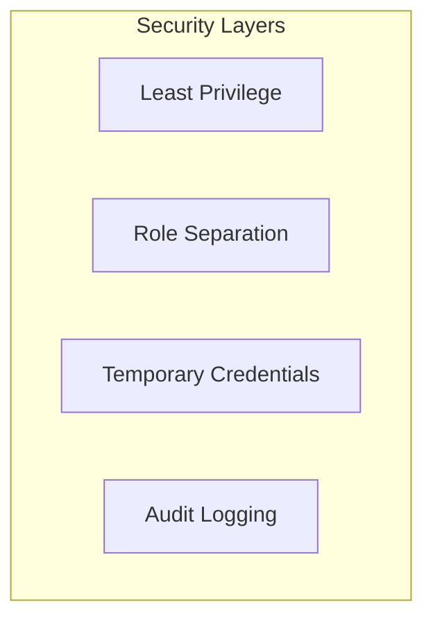
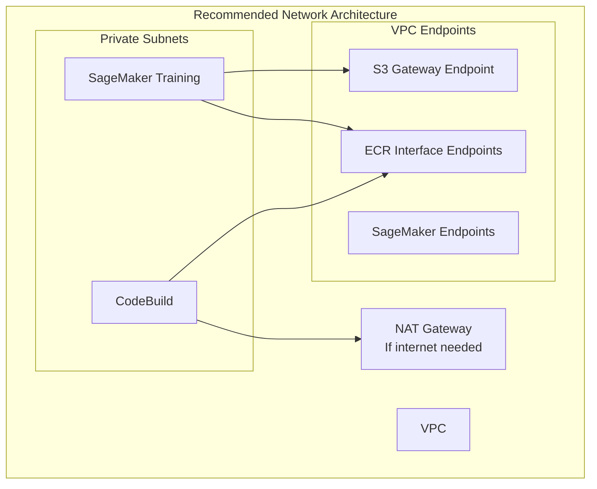

# ✅ Best Practices Guide

## Overview

This guide outlines production best practices for the ML Platform based on lessons learned from operating at Amazon scale. Following these practices will help ensure security, reliability, and cost-effectiveness.

---

## 1. Security Best Practices

### 1.1 IAM & Access Control



**✅ DO:**
- Use IAM roles over long-term credentials
- Apply least privilege principle
- Rotate credentials regularly (90 days max)
- Enable MFA for human users
- Use IAM conditions (IP, time, MFA)

**❌ DON'T:**
- Store credentials in code
- Share service accounts
- Use `Resource: "*"` in policies
- Grant admin access for debugging

**Example - Scoped IAM Policy:**
```json
{
  "Effect": "Allow",
  "Action": ["sagemaker:CreateTrainingJob"],
  "Resource": "arn:aws:sagemaker:*:*:training-job/ml-platform-*",
  "Condition": {
    "StringEquals": {
      "sagemaker:ResourceTag/project": "ml-platform"
    }
  }
}
```

---

### 1.2 Data Protection

| Layer | Mechanism | Status |
|-------|-----------|--------|
| At Rest (S3) | SSE-S3 or SSE-KMS | ✅ Default |
| At Rest (ECR) | AES-256 | ✅ Automatic |
| At Rest (EBS) | Encrypted volumes | ⚙️ Configure |
| In Transit | TLS 1.2+ | ✅ Enforced |

**✅ Recommended Actions:**
- Enable S3 bucket versioning
- Configure S3 access logging
- Use VPC endpoints for private traffic
- Block public access on all buckets

---

### 1.3 Network Security



---

## 2. Reliability Best Practices

### 2.1 High Availability

**SageMaker Endpoints:**
```python
endpoint_config = {
    "ProductionVariants": [{
        "InitialInstanceCount": 2,  # Minimum 2 for HA
        "InstanceType": "ml.m5.large"
    }]
}
```

**Multi-AZ Design:**
- S3: Automatic multi-AZ
- ECR: Automatic multi-AZ
- SageMaker: Spread instances across AZs
- Lambda: Automatic multi-AZ

---

### 2.2 Error Handling & Retries

**Exponential Backoff:**
```python
import time
from botocore.config import Config

config = Config(
    retries={
        'max_attempts': 5,
        'mode': 'exponential_backoff'
    }
)

client = boto3.client('sagemaker', config=config)
```

**SageMaker Training with Checkpointing:**
```python
estimator = Estimator(
    checkpoint_s3_uri="s3://bucket/checkpoints/",
    max_run=3600,
    max_wait=7200  # For spot instances
)
```

---

### 2.3 Deployment Safety

**Blue-Green Deployment:**
```python
sagemaker.update_endpoint(
    EndpointName='production',
    EndpointConfigName='new-config',
    DeploymentConfig={
        'BlueGreenUpdatePolicy': {
            'TrafficRoutingConfiguration': {
                'Type': 'LINEAR',
                'LinearStepSize': {'Type': 'CAPACITY_PERCENT', 'Value': 10}
            }
        },
        'AutoRollbackConfiguration': {
            'Alarms': [{'AlarmName': 'LatencyAlarm'}]
        }
    }
)
```

---

## 3. Cost Optimization Best Practices

### 3.1 Training Cost Optimization

| Strategy | Savings | Risk | Recommendation |
|----------|---------|------|----------------|
| Spot Instances | 60-90% | Interruption | Use with checkpointing |
| Right-sizing | 20-30% | Low | Analyze metrics first |
| Managed Warm Pools | 10-20% | Low | For frequent training |

**Spot Training Configuration:**
```python
estimator = Estimator(
    use_spot_instances=True,
    max_wait=7200,
    max_run=3600,
    checkpoint_s3_uri="s3://bucket/checkpoints/"
)
```

---

### 3.2 Inference Cost Optimization

**Auto-Scaling:**
```python
autoscaling.put_scaling_policy(
    PolicyName='target-tracking',
    ServiceNamespace='sagemaker',
    ResourceId='endpoint/prod/variant/main',
    ScalableDimension='sagemaker:variant:DesiredInstanceCount',
    PolicyType='TargetTrackingScaling',
    TargetTrackingScalingPolicyConfiguration={
        'TargetValue': 70.0,
        'PredefinedMetricSpecification': {
            'PredefinedMetricType': 'SageMakerVariantInvocationsPerInstance'
        },
        'ScaleInCooldown': 300,
        'ScaleOutCooldown': 60
    }
)
```

**Scale to Zero (Non-Production):**
```python
# Scheduled scaling for dev environments
autoscaling.put_scheduled_action(
    ScheduledActionName='night-scale-down',
    Schedule='cron(0 22 * * ? *)',  # 10 PM
    ScalableTargetAction={'MinCapacity': 0, 'MaxCapacity': 0}
)

autoscaling.put_scheduled_action(
    ScheduledActionName='morning-scale-up',
    Schedule='cron(0 8 * * ? *)',  # 8 AM
    ScalableTargetAction={'MinCapacity': 1, 'MaxCapacity': 5}
)
```

---

### 3.3 Storage Cost Optimization

**S3 Lifecycle Policies:**
```json
{
  "Rules": [
    {
      "ID": "Archive old artifacts",
      "Status": "Enabled",
      "Transitions": [
        {"Days": 90, "StorageClass": "STANDARD_IA"},
        {"Days": 365, "StorageClass": "GLACIER"}
      ]
    },
    {
      "ID": "Delete old versions",
      "Status": "Enabled",
      "NoncurrentVersionExpiration": {"NoncurrentDays": 30}
    }
  ]
}
```

**ECR Lifecycle Policy:**
```json
{
  "rules": [
    {
      "rulePriority": 1,
      "selection": {
        "tagStatus": "untagged",
        "countType": "sinceImagePushed",
        "countUnit": "days",
        "countNumber": 7
      },
      "action": {"type": "expire"}
    }
  ]
}
```

---

## 4. Operational Best Practices

### 4.1 Monitoring & Alerting

**Key Metrics to Monitor:**

| Category | Metric | Threshold |
|----------|--------|-----------|
| Availability | Endpoint Uptime | > 99.9% |
| Latency | P99 Response Time | < 200ms |
| Errors | Error Rate | < 1% |
| Saturation | CPU Utilization | < 80% |
| Training | Job Success Rate | > 95% |

**CloudWatch Alarms:**
```yaml
LatencyAlarm:
  Type: AWS::CloudWatch::Alarm
  Properties:
    AlarmName: sagemaker-high-latency
    MetricName: ModelLatency
    Namespace: AWS/SageMaker
    Statistic: p99
    Period: 60
    EvaluationPeriods: 3
    Threshold: 200000  # 200ms in microseconds
    ComparisonOperator: GreaterThanThreshold
    AlarmActions: [!Ref AlertSNSTopic]
```

---

### 4.2 Logging Standards

**Structured Logging:**
```python
import json
import logging

logger = logging.getLogger()

def log_prediction(request_id, model_version, latency_ms, success):
    logger.info(json.dumps({
        "event": "prediction",
        "request_id": request_id,
        "model_version": model_version,
        "latency_ms": latency_ms,
        "success": success
    }))
```

**Log Retention:**
| Log Type | Retention | Reason |
|----------|-----------|--------|
| Application Logs | 30 days | Debugging |
| Audit Logs | 1 year | Compliance |
| Training Logs | 90 days | Experiment tracking |
| Inference Logs | 14 days | Troubleshooting |

---

### 4.3 Tagging Strategy

**Required Tags:**

| Tag Key | Example Value | Purpose |
|---------|---------------|---------|
| `project` | `ml-platform` | Cost allocation |
| `environment` | `production` | Environment identification |
| `owner` | `mlops-team` | Ownership |
| `cost-center` | `cc-12345` | Billing |

**Tagging Enforcement:**
```yaml
# AWS Config Rule
TaggingRule:
  Type: AWS::Config::ConfigRule
  Properties:
    ConfigRuleName: required-tags
    Source:
      Owner: AWS
      SourceIdentifier: REQUIRED_TAGS
    InputParameters:
      tag1Key: project
      tag2Key: environment
```

---

## 5. ML-Specific Best Practices

### 5.1 Model Versioning

**Naming Convention:**
```
{model-name}-v{major}.{minor}.{patch}-{git-sha}
Example: fraud-detector-v2.1.3-abc123f
```

**Version Tracking:**
- Git tag for code version
- ECR tag for container version
- S3 versioning for artifacts
- SageMaker Model Registry for production

---

### 5.2 Data Quality

**Input Validation:**
```python
def validate_input(data):
    schema = {
        "type": "object",
        "required": ["features"],
        "properties": {
            "features": {
                "type": "array",
                "minItems": 10,
                "maxItems": 10,
                "items": {"type": "number"}
            }
        }
    }
    jsonschema.validate(data, schema)
```

**Data Drift Monitoring:**
```python
from scipy import stats

def detect_drift(reference_data, production_data, threshold=0.05):
    ks_stat, p_value = stats.ks_2samp(reference_data, production_data)
    return p_value < threshold
```

---

### 5.3 Experiment Tracking

**What to Track:**
- Hyperparameters
- Training metrics (loss, accuracy)
- Dataset version
- Model artifacts
- Environment (container, instance type)

---

## 6. Production Checklist

### Pre-Deployment

- [ ] Model validated on holdout test set
- [ ] Performance benchmarked
- [ ] Container scanned for vulnerabilities
- [ ] IAM permissions verified
- [ ] Rollback plan documented
- [ ] Alerts configured
- [ ] Load testing completed

### Post-Deployment

- [ ] Smoke tests passed
- [ ] Metrics baseline established
- [ ] Documentation updated
- [ ] On-call notified
- [ ] Runbook updated

---

## 7. Anti-Patterns to Avoid

| Anti-Pattern | Problem | Solution |
|--------------|---------|----------|
| Training in production account | Risk & cost | Use separate accounts |
| Manual deployments | Error-prone | Automate with CI/CD |
| Shared credentials | Security risk | Per-service accounts |
| No model monitoring | Silent failures | Implement drift detection |
| Oversized instances | Wasted spend | Right-size based on metrics |
| No checkpointing | Lost progress | Enable for all training |

---

## 🔗 Related Documents

- [Architecture Overview](../02-architecture/README.md)
- [Deployment Workflow](../03-deployment-workflow/README.md)
- [Troubleshooting](../06-troubleshooting/README.md)
