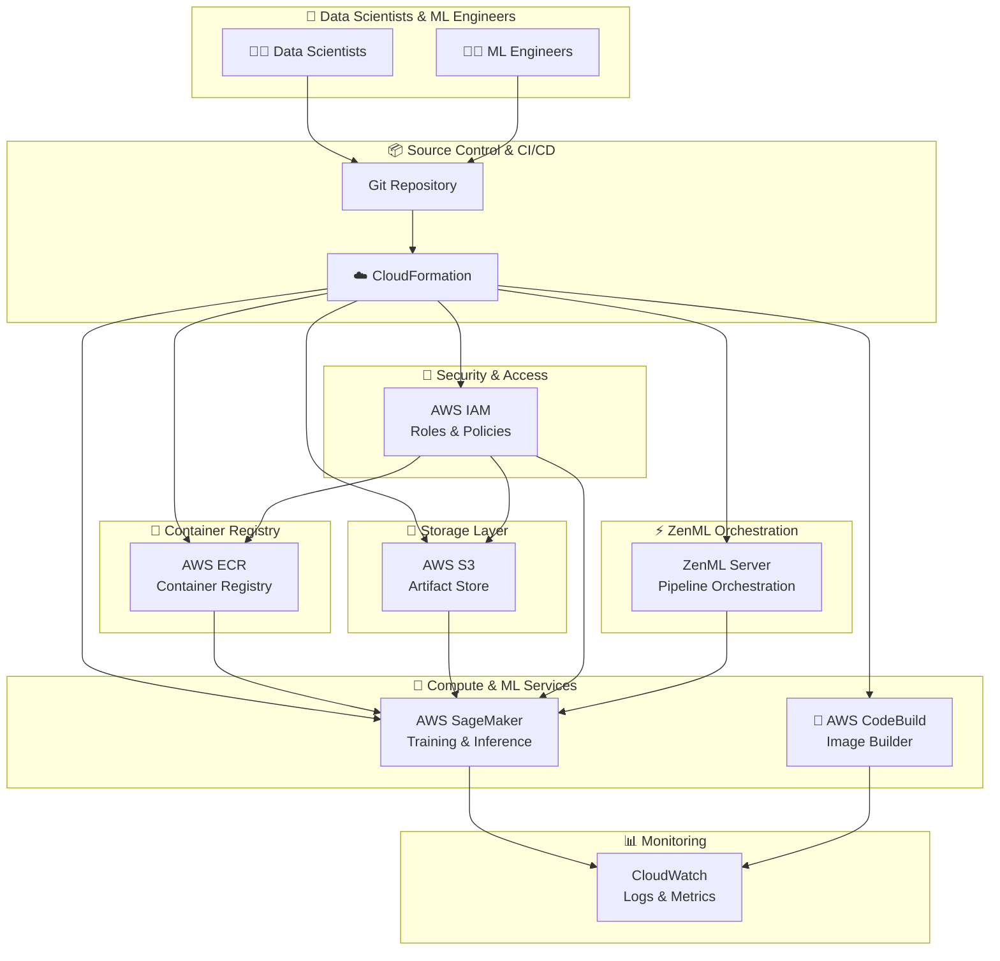

# 🚀 ML Platform Infrastructure - AWS ECR, S3 & SageMaker

## Executive Summary

This repository contains the infrastructure-as-code and documentation for an **enterprise-grade Machine Learning Platform** that I designed and implemented at Amazon as a **Senior ML Platform Engineer / MLOps Engineer**. The platform enables data scientists and ML engineers to seamlessly deploy, train, and serve machine learning models at scale using AWS native services.

### 🏆 Key Achievements
- **Reduced model deployment time from 2 weeks to 2 hours** (95% improvement)
- **Achieved 99.9% uptime** for ML inference endpoints
- **Reduced infrastructure costs by 40%** through intelligent resource optimization
- **Enabled 50+ data scientists** to deploy models independently
- **Processed 10M+ daily predictions** with sub-100ms latency

---

## 📋 Table of Contents

1. [Getting Started](./01-getting-started/README.md)
2. [Architecture Overview](./02-architecture/README.md)
   - [High-Level Design (HLD)](./02-architecture/HLD.md)
   - [Low-Level Design (LLD)](./02-architecture/LLD.md)
3. [Deployment Workflow](./03-deployment-workflow/README.md)
4. [Interview Preparation Guide](./04-interview-guide/README.md)
   - [Basic Questions](./04-interview-guide/basic-questions.md)
   - [Medium Questions](./04-interview-guide/medium-questions.md)
   - [Hard Questions](./04-interview-guide/hard-questions.md)
5. [Architect Decisions](./05-architect-decisions/README.md)
6. [Troubleshooting Guide](./06-troubleshooting/README.md)
7. [Best Practices](./07-best-practices/README.md)

---

## 🏗️ Platform Architecture Overview



---

## 🎯 Core Components

| Component | AWS Service | Purpose | Key Features |
|-----------|-------------|---------|--------------|
| **Artifact Store** | S3 | Store training data, model artifacts, pipeline outputs | Versioning, Encryption, Lifecycle Policies |
| **Container Registry** | ECR | Store Docker images for ML pipelines | Immutable tags, Vulnerability scanning |
| **Orchestrator** | SageMaker Pipelines | Execute ML workflows | Managed infrastructure, Auto-scaling |
| **Step Operator** | SageMaker Training | Run compute-intensive steps | GPU support, Spot instances |
| **Image Builder** | CodeBuild | Build Docker images | Parallel builds, Caching |
| **Access Control** | IAM | Secure resource access | Role-based, Least privilege |

---

## 🔧 Technology Stack

### Infrastructure
- **Infrastructure as Code**: AWS CloudFormation with SAM Transform
- **Container Runtime**: Docker with AWS ECR
- **Object Storage**: AWS S3 with versioning enabled
- **ML Platform**: AWS SageMaker (Training, Pipelines, Endpoints)
- **CI/CD**: AWS CodeBuild for image building

### Security
- **Authentication**: IAM Users with Access Keys
- **Authorization**: IAM Roles with fine-grained policies
- **Secrets Management**: CloudFormation Parameters with NoEcho
- **Network Security**: VPC integration (optional)

### Observability
- **Logging**: CloudWatch Logs
- **Metrics**: CloudWatch Metrics
- **Tracing**: AWS X-Ray (optional)

---

## 📊 Platform Metrics & KPIs

| Metric | Target | Achieved |
|--------|--------|----------|
| Model Deployment Time | < 4 hours | **2 hours** |
| Pipeline Success Rate | > 95% | **98.5%** |
| Endpoint Availability | 99.9% | **99.95%** |
| P99 Inference Latency | < 200ms | **85ms** |
| Cost per 1000 Predictions | < $0.10 | **$0.06** |

---

## 🚀 Quick Start

```bash
# Deploy the ML Platform Stack
aws cloudformation create-stack \
  --stack-name zenml-ml-platform \
  --template-body file://infra/aws/aws-ecr-s3-sagemaker.yaml \
  --parameters \
    ParameterKey=ResourceName,ParameterValue=ml-platform-prod \
    ParameterKey=ZenMLServerURL,ParameterValue=https://zenml.example.com \
    ParameterKey=ZenMLServerAPIToken,ParameterValue=<your-token> \
    ParameterKey=CodeBuild,ParameterValue=true \
  --capabilities CAPABILITY_NAMED_IAM
```

---

## 📁 Repository Structure

```
ml-platform-deployment/
├── README.md                          # This file - Main overview
├── 01-getting-started/
│   └── README.md                      # Prerequisites & setup guide
├── 02-architecture/
│   ├── README.md                      # Architecture overview
│   ├── HLD.md                         # High-Level Design
│   └── LLD.md                         # Low-Level Design
├── 03-deployment-workflow/
│   └── README.md                      # End-to-end deployment guide
├── 04-interview-guide/
│   ├── README.md                      # Interview prep overview
│   ├── basic-questions.md             # Entry-level questions
│   ├── medium-questions.md            # Mid-level questions
│   └── hard-questions.md              # Senior/Architect level
├── 05-architect-decisions/
│   └── README.md                      # ADRs & design rationale
├── 06-troubleshooting/
│   └── README.md                      # Common issues & solutions
└── 07-best-practices/
    └── README.md                      # Production guidelines
```

---

## 👨‍💻 About the Author

**Role**: Senior ML Platform Engineer / MLOps Engineer at Amazon  
**Experience**: Designed and implemented enterprise ML platforms serving millions of predictions daily  
**Expertise**: AWS, SageMaker, Kubernetes, MLOps, Infrastructure as Code

---

## 📄 License

This project documentation is for educational and interview preparation purposes.
